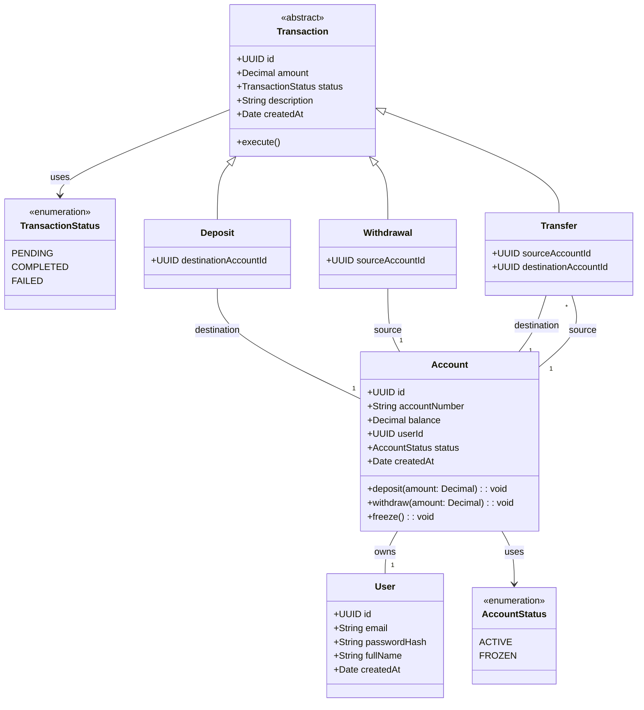

# ESPECIFICACIÓN DE REQUISITOS DEL SISTEMA (SRS)

## Proyecto Integrador: _Fintech Core System_

## 1. INTRODUCCIÓN

### 1.1. Propósito

El presente documento especifica los requisitos funcionales y no funcionales para el desarrollo del sistema **Fintech Core App**, una plataforma de servicios financieros centrada en la gestión de cuentas, autenticación de usuarios y procesamiento de transferencias monetarias atómicas. Este documento sirve como guía arquitectónica y funcional para la implementación técnica en el workshop _Full Stack Software Architecture_.

### 1.2. Alcance del Sistema

El sistema comprende un core transaccional web completo. Incluye:

- Registro y autenticación segura de clientes.
- Gestión de cuentas bancarias/financieras asociadas a cada cliente.
- Módulo de ejecución de transferencias monetarias atómicas de fondos.
- Historial transaccional y consulta de saldos en tiempo real.
- Auditoría e invariantes financieras en backend y frontend.

### 1.3. Definiciones, Acrónimos y Abreviaturas

- **ACID**: Atomicity, Consistency, Isolation, Durability (Propiedades transaccionales de DB).
- **DTO**: Data Transfer Object.
- **JWT**: JSON Web Token.
- **Invariante de Dominio**: Regla de negocio que debe cumplirse en todo momento y estado del sistema (ej. un saldo no puede ser negativo salvo línea de crédito autorizada).
- **Clean Architecture**: Patrón arquitectónico que separa la lógica de negocio central de los detalles de infraestructura.

## 2. DESCRIPCIÓN GENERAL

### 2.1. Perspectiva del Producto

El _Fintech Core App_ es un sistema web monolítico modular basado en una arquitectura desacoplada (_Decoupled Architecture_), compuesto por un backend en Node.js/Express con TypeScript y un frontend reactivo en React + Vite.

### 2.2. Perfiles de Usuario

- **Cliente / Usuario Autenticado**: Persona registrada en la plataforma capaz de poseer una o más cuentas financieras, realizar transferencias y consultar sus estados de cuenta e historial de operaciones.
- **Sistema / Auditor Interno**: Proceso automatizado que valida la integridad de los débitos y créditos en las transacciones.

### 2.3. Restricciones Técnicas

1. **Lenguaje Unificado**: TypeScript obligatorio tanto en backend como en frontend.
2. **Consistencia Relacional**: Motor de base de datos PostgreSQL mediante Prisma ORM.
3. **Aislamiento de Lógica**: Las entidades de dominio no deben importar librerías de infraestructura (Express, Prisma, Axios, React).

## 3. REQUISITOS FUNCIONALES (RF)

### 3.1. Módulo 1: Autenticación y Gestión de Usuarios

#### RF-1.1: Registro de Usuarios

**Historia de Usuario**: Yo como usuario nuevo quiero registrarme en la plataforma proporcionando mis datos personales para obtener acceso a los servicios financieros de la aplicación.

- **Descripción y Validaciones**: Se requiere capturar nombre completo, correo único, documento y contraseña. La contraseña debe tener mínimo 8 caracteres, al menos una mayúscula y un número. El correo electrónico debe ser validado contra registros existentes para garantizar unicidad. Al completar el registro, se disparará una lógica de negocio para crear automáticamente una cuenta inicial vinculada al nuevo ID de usuario.
- **Pruebas de Aceptación**:
  - **Escenario 1 (Registro Exitoso)**: Datos válidos y correo inexistente; el usuario es creado, se genera su cuenta inicial y el sistema retorna un código 201.
  - **Escenario 2 (Correo Duplicado)**: Intento de registro con email existente; el sistema rechaza la operación con error 400 y mensaje específico de "email ya registrado".
  - **Escenario 3 (Contraseña Insegura)**: Contraseña sin números o de menos de 8 caracteres; el sistema rechaza la operación con error 400 y mensaje de validación de seguridad.
  
#### RF-1.2: Autenticación de Usuarios (Login)

**Historia de Usuario**: Yo como usuario registrado quiero iniciar sesión con mis credenciales para acceder de forma segura a mi dashboard financiero y realizar operaciones.

- **Descripción y Validaciones**: El sistema debe verificar el hash de la contraseña almacenada mediante bcrypt. Tras la autenticación exitosa, el sistema generará un token JWT con vigencia de 8 horas, incluyendo en su payload la información mínima necesaria para el contexto del usuario.
- **Pruebas de Aceptación**:
  - **Escenario 1 (Login Exitoso)**: Credenciales correctas; el sistema retorna un token JWT válido y datos básicos de perfil (status 200).
  - **Escenario 2 (Credenciales Inválidas)**: Email incorrecto o contraseña errónea; el sistema deniega el acceso con error 401 sin exponer detalles internos de la base de datos.
  - **Escenario 3 (Token Vencido/Inválido)**: Intento de acceso a endpoints protegidos con un token expirado o mal formado; el sistema responde con error 401.

#### RF-1.3: Middleware de Control de Acceso

**Historia de Usuario**: Yo como desarrollador quiero implementar un mecanismo de seguridad en los endpoints para asegurar que solo usuarios autenticados puedan consumir los servicios financieros de la aplicación.

- **Descripción y Validaciones**: Este componente debe validar la presencia y validez del _Bearer Token_ en el header `Authorization`. Cualquier petición que carezca de token o cuya firma sea inválida debe ser interceptada antes de llegar a la lógica de negocio.
- **Pruebas de Aceptación**:
  - **Escenario 1 (Acceso sin Token)**: Petición a endpoint protegido sin header `Authorization`; el sistema responde con error 401 Unauthorized.
  - **Escenario 2 (Acceso con Token Válido)**: Petición a endpoint protegido con JWT vigente; el sistema permite el paso al controlador correspondiente.

### 3.2. Módulo 2: Gestión de Cuentas y Saldos

#### RF-2.1: Creación de Cuenta Financiera

**Historia de Usuario**: Yo como usuario registrado quiero solicitar la creación de una cuenta de ahorros o corriente para gestionar mis fondos dentro de la plataforma.

- **Descripción y Validaciones**: El sistema debe asignar un número de cuenta único y automático. La cuenta inicia con un saldo de apertura $B_0 \ge 0$. Si el usuario ya posee una cuenta, el sistema debe permitir la creación de cuentas adicionales bajo el mismo perfil.
- **Pruebas de Aceptación**:
  - **Escenario 1 (Creación Exitosa)**: El usuario solicita una nueva cuenta; el sistema genera el número único, asigna el saldo inicial y retorna el objeto cuenta creado (201).
  **Escenario 2 (Usuario No Autenticado)**: El usuario intenta crear una cuenta sin estar autenticado; el sistema rechaza la operación con error 401.

#### RF-2.2: Consulta de Saldos y Detalle de Cuentas

**Historia de Usuario**: Yo como usuario autenticado quiero consultar el saldo disponible y el estado de mis cuentas para tener visibilidad de mis finanzas en tiempo real.

- **Descripción y Validaciones**: El usuario debe poder listar todas sus cuentas asociadas. El saldo debe mostrarse con precisión de dos decimales. El estado de la cuenta puede ser `ACTIVE` o `FROZEN`.
- **Pruebas de Aceptación**:
  - **Escenario 1 (Consulta Exitosa)**: El usuario solicita el detalle de sus cuentas; el sistema retorna la lista de cuentas con su saldo actual, número de cuenta y estado (200).
  - **Escenario 2 (Sin Cuentas)**: El usuario no tiene cuentas creadas aún; el sistema retorna una lista vacía (200) o un mensaje informativo.
  - **Escenario 3 (Cuenta Congelada)**: Si la cuenta está en estado `FROZEN`, el sistema muestra el saldo pero restringe operaciones de débito.

### 3.3. Módulo 3: Transacciones Financieras Atómicas

#### RF-3.1: Ingreso de Fondos

**Historia de Usuario**: Yo como usuario autenticado quiero realizar un ingreso de fondos en mi cuenta para aumentar mi saldo disponible.

- **Descripción y Validaciones**: Se recibe el ID de cuenta destino y el monto. El sistema registra un crédito y aumenta el saldo de la cuenta.
- **Pruebas de Aceptación**:
  - **Escenario 1 (Ingreso Exitoso)**: `Monto > 0`; se acredita saldo y se registra transacción tipo `DEPOSIT` (201).
  - **Escenario 2 (Monto Inválido)**: `Monto <= 0`; el sistema rechaza con error 400.

#### RF-3.2: Retiro de Fondos

**Historia de Usuario**: Yo como usuario autenticado quiero retirar fondos de mi cuenta para disponer de efectivo.

- **Descripción y Validaciones**: Se recibe el ID de cuenta origen y el monto. Se valida saldo suficiente y cuenta activa antes de debitar.
- **Pruebas de Aceptación**:
  - **Escenario 1 (Retiro Exitoso)**: Saldo suficiente y cuenta activa; se debita y se registra transacción `WITHDRAWAL` (201).
  - **Escenario 2 (Saldo Insuficiente)**: Monto excede saldo; el sistema rechaza con error 400.

#### RF-3.3: Transferencia de Fondos entre Cuentas

**Historia de Usuario**: Yo como usuario autenticado quiero transferir un monto específico desde una cuenta propia hacia la cuenta de otro usuario para enviar dinero de forma segura.

- **Descripción y Validaciones**: Se reciben los ID de cuenta origen, destino y monto. La operación debe validar que la cuenta origen tenga saldo suficiente ($B_{\text{origen}} \ge \text{monto}$) y que ambas cuentas estén activas. La lógica debe ejecutarse mediante una transacción atómica (todo o nada).
- **Pruebas de Aceptación**:
  - **Escenario 1 (Transferencia Exitosa)**: Datos válidos y saldo suficiente; se debita origen, se acredita destino, se registra transacción `TRANSFER` y se retorna 201.
  - **Escenario 2 (Saldo Insuficiente)**: La cuenta origen tiene menos fondos que el monto solicitado; el sistema rechaza con error 400.
  - **Escenario 3 (Cuenta Destino Inexistente)**: El ID de cuenta destino no existe; el sistema rechaza la operación con error 404.
  - **Escenario 4 (Cuenta Congelada)**: La cuenta origen está en estado `FROZEN`; el sistema bloquea el débito y retorna error 400.

### RF-3.4: Historial de Transacciones

**Historia de Usuario**: Yo como usuario autenticado quiero ver la lista cronológica de mis movimientos financieros para poder auditar mis gastos y recibos.

- **Descripción y Validaciones**: El sistema debe devolver una lista paginada (o completa) de transacciones vinculadas a las cuentas del usuario, diferenciando entre débitos y créditos.
- **Pruebas de Aceptación**:
  - **Escenario 1 (Consulta Exitosa)**: El usuario solicita su historial; el sistema retorna una lista ordenada por fecha descendente con detalle de contraparte y monto (200).
  - **Escenario 2 (Sin Movimientos)**: El usuario tiene cuentas nuevas sin transacciones; el sistema retorna un array vacío (200).
  
  ## 4. REQUISITOS NO FUNCIONALES (RNF)
  
  ### 4.1. Mantenibilidad y Arquitectura (RNF-1)
  
  El código fuente backend debe respetar estrictamente el patrón de capas de **Clean Architecture**:
  
  - `domain/`: Reglas de negocio puras, tipos, interfaces de repositorios.
  - `use-cases/`: Lógica de orquestación (casos de uso).
  - `infrastructure/`: Implementaciones concretas de DB (Prisma), Hash (bcrypt), Auth (JWT).
  - `presentation/`: Express Controllers, DTOs y Middlewares.
  
### 4.2. Consistencia y Concurrencia (RNF-2)

- **Prevenir Race Conditions (Condiciones de Carrera)**: En caso de múltiples peticiones simultáneas sobre la misma cuenta, el sistema debe garantizar el bloqueo de filas o el control optimista/pesimista para evitar inconsistencias en el balance saldo ($B$).
- **Modelado Decimal Seguro**: Los valores monetarios no deben almacenarse ni calcularse utilizando números de coma flotante estándar de IEEE 754 (number estándar de JS). Se utilizará el tipo Decimal (Prisma / decimal.js).

### 4.3. Seguridad (RNF-3)

- Hashing de contraseñas mediante **bcrypt** con un factor de costo mínimo de 10.
- Sensibilidad de errores: La API no debe retornar stack traces ni detalles internos de PostgreSQL al cliente ante excepciones imprevistas.

### 4.4. Usabilidad e Interfaz Frontend (RNF-4)

La aplicación en ReactJS debe proveer retroalimentación clara de los estados asincrónicos (loading, disabled en botones durante transferencias) para evitar el reenvío múltiple de formularios por múltiples clics.

## 5. MODELO DE DATOS Y DOMINIO

## 6. CRITERIOS DE ACEPTACIÓN (DEFINITION OF DONE - DoD)

Un requerimiento o sesión de desarrollo se considerará finalizado cuando cumpla con los siguientes criterios:

1. **Clean Code & Tipado**: Cero uso del tipo `any` en TypeScript.
2. **Manejo de Errores**: Errores de negocio representados mediante clases de excepción de dominio personalizadas (ej. `InsufficientBalanceError`, `AccountNotFoundError`).
3. **Persistencia**: Todas las modificaciones de datos financieros deben persistirse en PostgreSQL vía Prisma.
4. **Integración End-to-End**: Las acciones ejecutadas en la interfaz de React deben verse reflejadas correctamente en la base de datos y ser visibles al refrescar la información.
