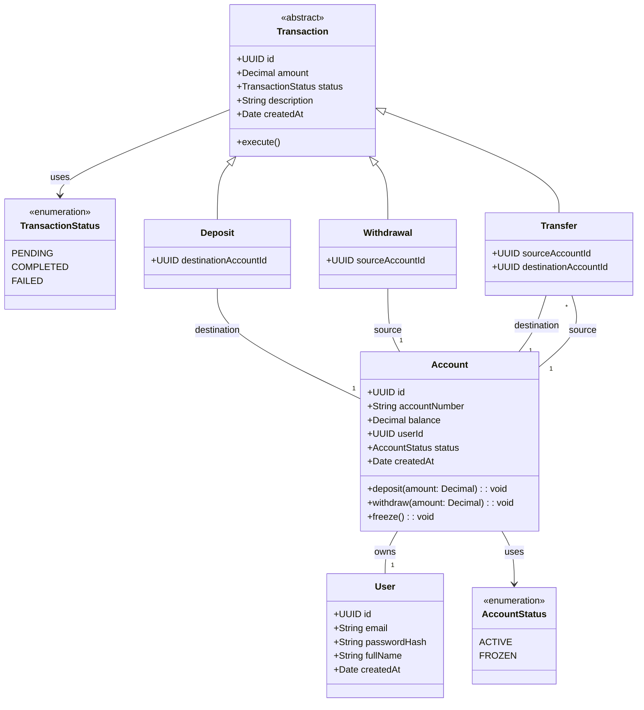

# SESIÓN 1: Principios de Clean Architecture y Diseño de Dominio

**Duración**: 2 Horas (45 min Teoría / 75 min Práctica)

## 1. INTRODUCCIÓN Y OBJETIVOS (15 min)

¡Bienvenidos a la primera sesión de _Full Stack Software Architecture_!

En la industria del software moderno, especialmente en sectores críticos como el financiero (Fintech), el código trasciende la simple necesidad de "funcionar en el escenario ideal". Un sistema que simplemente "hace lo que se le pide" es insuficiente. El software de grado empresarial debe ser estrictamente auditable, altamente escalable, rigurosamente testable y, sobre todo, **seguro y consistente por diseño**.

Un error de arquitectura en una red social puede resultar en que un usuario no vea un "**Like**"; sin embargo, en una Fintech, puede significar la pérdida irreversible de fondos, la exposición de datos sensibles, multas regulatorias millonarias y la destrucción de la confianza en la empresa.

El objetivo principal de este curso no es solo aprender a usar herramientas de moda, sino adoptar un cambio de mentalidad estructural. Dejaremos de pensar en "tablas de base de datos" y "pantallas web", para empezar a pensar en "reglas de negocio", "comportamientos" y "casos de uso".

En esta primera sesión construiremos los cimientos inquebrantables de nuestro sistema. Al finalizar, seremos capaces de:

1. **Comprender el patrón Clean Architecture**: Entender cómo proteger nuestras reglas de negocio y por qué la "Regla de Dependencia" es el secreto para un software que sobrevive al paso del tiempo y al cambio de tecnologías.
2. **Dominar el Tooling Profesional**: Configurar un entorno de desarrollo en **Node.js** y **TypeScript** bajo el estándar draconiano de "**Cero `any`**", asegurando que el compilador trabaje para nosotros.
3. **Modelar Entidades de Dominio (DDD)**: Traducir los requerimientos del negocio (Usuarios, Cuentas, y una compleja jerarquía de Transacciones) a código puro, aplicando invariantes del sistema y evitando el antipatrón del "Modelo de Dominio Anémico".
4. **Aplicar los Principios SOLID**: Específicamente el Principio de Inversión de Dependencias (DIP) y el Principio Abierto/Cerrado (OCP) para desacoplar el núcleo de nuestra aplicación de cualquier base de datos u ORM.

## 2. MARCO TEÓRICO: ARQUITECTURA Y DOMINIO (45 min)

### 2.1. El Problema del Acoplamiento y la Deuda Técnica

Tradicionalmente, en la arquitectura de tres capas clásica (Presentación, Lógica, Datos) o en arquitecturas fuertemente orientadas a frameworks (como MVC básico), solemos incurrir en un grave error: la mezcla de responsabilidades.

Es extremadamente común ver un controlador de Express (o un servicio monolítico) donde, en un mismo archivo de 500 líneas, se validan headers HTTP, se ejecutan sentencias SQL directamente a través de un ORM como TypeORM o Prisma, y se decide matemáticamente si un usuario tiene saldo suficiente para un retiro.

**¿Cuál es el peligro de este enfoque acoplado?**

- **Fragilidad y Parálisis Tecnológica**: ¿Qué sucede si el próximo año, por requerimientos de rendimiento, necesitamos migrar nuestro servidor web de Express a Fastify? ¿O si la empresa decide cambiar de PostgreSQL (con Prisma) a MongoDB? **Todo el sistema se rompe**. Nos veríamos obligados a reescribir la lógica financiera simplemente porque estaba enredada con los objetos `req` y `res` del framework web.
- **Imposibilidad de Pruebas Unitarias Aisladas (Testing)**: Para probar si la lógica de un retiro financiero es correcta, te ves obligado a levantar un contenedor de Docker con una base de datos real, enviar un request HTTP mockeado, y parsear la respuesta JSON. Las pruebas dejan de ser unitarias; se vuelven lentas, costosas de mantener y frágiles ("_flaky tests_").
- **Falta de Expresividad (Screaming Architecture)**: Si abres un proyecto y ves carpetas llamadas `/controllers`, `/models`, `/views`, `/routes`, el proyecto está "gritando" que es una aplicación web MVC genérica, pero no te dice absolutamente nada sobre el negocio que resuelve. Un proyecto debería gritar su propósito: "**¡Soy un sistema de transferencias financieras!**".

### 2.2. Clean Architecture y la Regla de Dependencia

Para solucionar estos problemas, Robert C. Martin (Uncle Bob) propuso la _Arquitectura Limpia_. Esta filosofía propone una revolución organizativa: colocar las políticas y reglas del negocio en el centro absoluto del sistema y empujar los detalles técnicos (bases de datos, interfaces de usuario, frameworks HTTP, APIs de terceros) hacia los bordes.

La ley inquebrantable de este diseño es la **Regla de Dependencia**:

> _Las dependencias a nivel de código fuente (los `imports`) solo pueden apuntar hacia adentro. El código de las capas exteriores puede depender de las interiores, pero el código de las capas interiores NO PUEDE conocer absolutamente nada de las capas exteriores._

La estructura base, será un ecosistema de capas concéntricas:


1. **Domain (`/domain`)**: El corazón. Contiene Entidades puras, reglas de negocio inmutables, excepciones personalizadas y contratos (interfaces). **Cero dependencias externas**. Aquí no existe Express, no existe Prisma, ni siquiera el concepto de "Base de Datos". Es JavaScript/TypeScript 100% agnóstico.
2. **Application (`/application` o  `/use-cases`)**: La capa de orquestación. Define qué hace el sistema paso a paso (ej. `TransferMoneyUseCase`). Coordina la interacción entre las entidades y los repositorios de datos.
3. **Presentation (`/presentation`)**: La capa de entrada y salida. Controladores HTTP, WebSockets, o CLI. Su única función es traducir los datos de la web al formato que los Casos de Uso entienden.
4. **Infrastructure (`/infrastructure`)**: Los detalles de implementación sucios. Bases de datos (PostgreSQL), ORMs, servicios de correos (AWS SES, SendGrid), y librerías de encriptación.


### 2.3. Principios SOLID aplicados a TypeScript


Los principios SOLID son un acrónimo introducido por Robert C. Martin que establece cinco directrices esenciales de diseño orientado a objetos. En TypeScript y en Clean Architecture, SOLID no es un adorno teórico: es la herramienta que nos permite lograr un código extensible, libre de regresiones y totalmente desacoplado.

#### 2.3.1. Single Responsibility Principle (SRP - Principio de Responsabilidad Única)

> "_Una clase o módulo debe tener una, y solo una, razón para cambiar._"

Cada clase debe encargarse de un único aspecto funcional del sistema. Mezclar lógica de validación, persistencia e interfaz HTTP en una sola clase genera un código frágil donde modificar la BD puede romper la lógica financiera.

- **Incorrecto (Violación de SRP)**:

  ```typescript copy
  // Mal: La clase maneja persistencia, negocio y formato HTTP
  class AccountManager {
    public async withdrawMoney(req: ExpressRequest, res: ExpressResponse) {
      const { accountId, amount } = req.body;
      const account = await db.query('SELECT * FROM accounts WHERE id = ' + accountId);

      if (account.balance < amount) {
        return res.status(400).send("Saldo insuficiente");
      }
      
      account.balance -= amount;
      await db.query('UPDATE accounts SET balance = ...');
      res.json({ message: "Éxito" });
    }
  }
  ```

- **Correcto (Aplicando SRP en TypeScript)**:

  ```typescript copy
  // 1. La entidad Account se encarga ÚNICAMENTE de las reglas de saldo
  export class Account {
    private balance: Decimal;
    
    public withdraw(amount: Decimal): void {
      if (this.balance.lessThan(amount)) {
        throw new InsufficientBalanceError();
      }
      this.balance = this.balance.minus(amount);
    }
  }

  // 2. El caso de uso se encarga ÚNICAMENTE de orquestar la operación
  export class WithdrawUseCase {
    constructor(private accountRepo: AccountRepository) {}
    public async execute(accountId: string, amount: Decimal): Promise<void> { ... }
  }
  ```

#### 2.3.2. Open/Closed Principle (OCP - Principio Abierto/Cerrado)

> "_Las entidades de software deben estar abiertas a la extensión, pero cerradas a la modificación._"

Debemos ser capaces de agregar nuevas funcionalidades (como nuevos tipos de transacciones) sin modificar el código existente que ya ha sido probado y está en producción.

- **Incorrecto (Violación de OCP)**:

  ```typescript copy
  // Mal: Cada nuevo tipo de transacción nos obliga a modificar este bloque switch/if
  class TransactionProcessor {
    process(transaction: any) {
      if (transaction.type === 'DEPOSIT') {
        // lógica depósito
      } else if (transaction.type === 'WITHDRAWAL') {
        // lógica retiro
      } else if (transaction.type === 'TRANSFER') {
        // lógica transferencia
      }
    }
  }
  ```

- **Correcto (Aplicando OCP mediante Polimorfismo en TypeScript)**:

  ```typescript copy
  // La clase base y subclases permiten agregar 'FeeTransaction' o 'CashbackTransaction'
  // extendiendo 'Transaction' sin tocar el código de las transacciones existentes.
  export abstract class Transaction {
    abstract execute(): void;
  }

  export class Deposit extends Transaction {
    execute(): void { /* Lógica de Depósito */ }
  }

  export class Transfer extends Transaction {
    execute(): void { /* Lógica de Transferencia */ }
  }
  ```

#### 2.3.3. Liskov Substitution Principle (LSP - Principio de Sustitución de Liskov)

> "_Si $S$ es un subtipo de $T$, los objetos de tipo $T$ en un programa pueden ser reemplazados por objetos de tipo $S$ sin alterar ninguna de las propiedades deseables de ese programa._"

Las subclases no deben alterar ni romper el comportamiento ni las expectativas de contrato definidas por la clase base.

- **Incorrecto (Violación de LSP)**:

  ```typescript copy
  class BasicAccount {
    withdraw(amount: Decimal): void {
      // descuenta saldo
    }
  }

  class FixedTermAccount extends BasicAccount {
    override withdraw(amount: Decimal): void {
      // Rompe el contrato lanzando un error inesperado porque no permite retiros antes de la fecha
      throw new Error("Fatal: No se puede retirar dinero de una cuenta a plazo fijo");
    }
  }
  ```

- **Correcto (Aplicando LSP en TypeScript)**:

  ```typescript copy
  // Diseñamos jerarquías donde las subclases cumplen cabalmente el comportamiento prometido.
  export abstract class Transaction {
    protected status: TransactionStatus = 'PENDING';
    
    public markAsCompleted(): void {
      this.status = 'COMPLETED';
    }
  }

  // Tanto Deposit como Withdrawal o Transfer respetan completamente el ciclo de vida de Transaction
  export class Deposit extends Transaction {
    override execute(): void {
      this.markAsCompleted(); // Respeta íntegramente la especificación base
    }
  }
  ```

#### 2.3.4. Interface Segregation Principle (ISP - Principio de Segregación de Interfaces)

> "_Ningún cliente debe ser obligado a depender de interfaces que no utiliza._"

Es preferible crear varias interfaces pequeñas y específicas en lugar de una interfaz gigantesca ("monolítica").

- **Incorrecto (Violación de ISP)**:

  ```typescript copy
  // Mal: Interfaz 'Gorda' que obliga a implementar métodos irrelevantes
  interface ISystemRepository {
    findUserById(id: string): User;
    saveUser(user: User): void;
    sendEmailNotification(msg: string): void; // ¿Por qué un repositorio envía e-mails?
    generatePdfReport(accountId: string): Buffer; // ¿Por qué genera PDFs?
  }
  ```

- **Correcto (Aplicando ISP en TypeScript)**:

  ```typescript copy
  // Interfaces segregadas por propósito y dominio específico
  export interface UserRepository {
    findById(id: string): Promise<User | null>;
    save(user: User): Promise<void>;
  }

  export interface INotificationService {
    sendEmail(to: string, subject: string, body: string): Promise<void>;
  }
  ```

#### 2.3.5. Dependency Inversion Principle (DIP - Principio de Inversión de Dependencias)

> "_Los módulos de alto nivel no deben depender de módulos de bajo nivel. Ambos deben depender de abstracciones. Las abstracciones no deben depender de los detalles; los detalles deben depender de las abstracciones._"

Este es el pilar de Clean Architecture. La capa de Dominio y Casos de Uso (alto nivel) define interfaces (abstracciones), y la capa de Infraestructura (bajo nivel, p. ej. Prisma/PostgreSQL) implementa esas interfaces.

- **Incorrecto (Violación de DIP)**:

  ```typescript copy
  import { PrismaClient } from '@prisma/client'; // ¡Alto nivel depende directamente de Bajo Nivel!

  export class AccountService {
    private prisma = new PrismaClient(); // Acoplado directamente a Prisma

    async getBalance(id: string) {
      return await this.prisma.account.findUnique({ where: { id } });
    }
  }
  ```

- **Correcto (Aplicando DIP en TypeScript)**:

  ```typescript copy
  // 1. Abstracción en la Capa de Dominio (/domain/repositories/AccountRepository.ts)
  export interface AccountRepository {
    findById(id: string): Promise<Account | null>;
  }

  // 2. El Caso de Uso de Alto Nivel depende de la Interfaz, NO de Prisma
  export class GetBalanceUseCase {
    constructor(private accountRepo: AccountRepository) {} // Inyección de Dependencia

    async execute(id: string): Promise<Decimal> {
      const account = await this.accountRepo.findById(id);
      if (!account) throw new AccountNotFoundError();
      return account.balance;
    }
  }
  ```

### 2.4. Fundamentos de DDD y Mapeo de la Realidad del Negocio


El **Diseño Guiado por el Dominio (Domain-Driven Design - DDD)**, acuñado por Eric Evans en 2003, es un enfoque de desarrollo de software centrado en resolver la complejidad del negocio alineando la estructura y el código directamente con los modelos mentales de los expertos de la industria.

En aplicaciones convencionales, los ingenieros tienden a comenzar por el diseño de la base de datos (tablas, llaves foráneas, SQL). DDD propone lo opuesto: **el software no se modela alrededor de los datos persistidos, sino alrededor de los procesos, reglas y comportamientos del negocio real**.

#### 2.4.1. El Lenguaje Ubicuo (Ubiquitous Language)

Uno de los pilares más potentes de DDD es la eliminación de la "traducción mental" entre el equipo de producto/negocio y el equipo de ingeniería.

- **El Problema**: El auditor bancario habla de "_débito por transferencia sin saldo suficiente_", mientras que el programador habla de "_error de FK en la tabla accounts_transactions con status HTTP 500_". Esta desconexión causa malentendidos, bugs y requerimientos mal implementados.
- **La Solución**: DDD exige la creación de un **Lenguaje Ubicuo**, un vocabulario riguroso, compartido e inequívoco utilizado por igual en conversaciones, especificaciones de requerimientos (SRS), diagramas de arquitectura y en el **código fuente**.
- **Ejemplo en nuestra Fintech**: En nuestro código no existen métodos como `updateAccountRow()`. Existen métodos de dominio como `account.withdraw()`, `account.freeze()` o `transaction.markAsCompleted()`. Si una regla falla, el código lanza una excepción llamada `InsufficientBalanceError` o `AccountFrozenError`, reflejando exactamente el lenguaje del negocio.

#### 2.4.2. División del Dominio: Estratégico vs. Táctico

DDD se divide en dos dimensiones de diseño:

1. **DDD Estratégico (Visión de Macro-Arquitectura)**: Define cómo se delimita un sistema complejo en partes manejables llamadas **Contextos Delimitados (Bounded Contexts)**. En nuestra plataforma Fintech, podríamos identificar contextos como _Core Transaccional_ (Cuentas y Transferencias), _Autenticación e Identidad_ (Usuarios y Credenciales), y _Notificaciones_ (Envío de SMS/Emails). Cada **Bounded Context** tiene su propio modelo y su propio Lenguaje Ubicuo.
2. **DDD Táctico (Patrones de Diseño en Código)**:Ofrece las herramientas de modelado de clases que implementaremos en el laboratorio:
    - **Entidades (Entities)**: Objetos con una identidad única e inmutable a lo largo del tiempo (ej. una `Account` identificada por un UUID). Sus propiedades cambian (el saldo sube o baja), pero la entidad sigue siendo la misma.
    - **Objetos de Valor (Value Objects)**: Objetos definidos exclusivamente por sus atributos y que no poseen identidad única. Son inmutables. (Ej. El concepto de `Money` o un `Email` validado).
    - **Agregados y Raíces de Agregado (Aggregates & Aggregate Roots)**: Un grupo de entidades e invariantes asociadas que se tratan como una unidad atómica para la modificación de datos (ej. `Account` actúa como la raíz que encapsula y protege sus transacciones asociadas).

#### 2.4.3. Modelo de Dominio Rico vs. Modelo de Dominio Anémico

Uno de los errores de diseño más extendidos en la industria es el **Modelo de Dominio Anémico** (considerado un antipatrón por Martin Fowler):

- **Modelo Anémico**: Las clases de entidad son meros contenedores de datos (`getters` y `setters` públicos sin lógica). La lógica de negocio termina dispersa en clases de "Servicios" externas que manipulan directamente los datos de la entidad.
- **Modelo Rico (El enfoque DDD)**: Las entidades empaquetan tanto los datos como el comportamiento que los modifica. La entidad `Account` es la única responsable de saber cómo depositar o retirar dinero de sí misma, validando internamente sus propias reglas antes de mutar su estado.

#### 2.4.4. Invariantes de Dominio y Mapeo de Reglas Financieras

Una **Invariante** es una condición o regla de negocio absoluta que **debe cumplirse en todo momento** durante el ciclo de vida de un objeto de dominio. Si un objeto se encuentra en un estado que viola una invariante, el sistema está corrupto.

En nuestra Fintech, mapeamos las siguientes invariantes del mundo real a código:

1. **Invariante de Saldo Positivo**: $B \ge 0$. Una cuenta corriente estándar no puede crearse ni quedar con saldo negativo. La entidad `Account` rechaza cualquier operación `withdraw()` que vulnere esta regla lanzando `InsufficientBalanceError`.
2. **Invariante de Cuentas Congeladas**: Una cuenta en estado `FROZEN` prohíbe categóricamente los débitos o transferencias salientes.
3. **Invariante de Transferencias Atómicas**: No se pueden realizar transferencias hacia la misma cuenta de origen ($Account_{origen} \neq Account_{destino}$).
4. **Precision Monetaria (Problema IEEE 754)**: En dinero real, los centavos no pueden aparecer o desaparecer por imprecisiones flotantes. El tipo nativo `number` de JS (punto flotante de 64 bits según IEEE 754) produce inconsistencias aritméticas (ej. `0.1 + 0.2 = 0.30000000000000004`). En DDD, mapeamos la precisión del dinero utilizando la librería `decimal.js`, garantizando exactitud matemática absoluta en los cálculos de saldo.

## 3. LABORATORIO PRÁCTICO: LIVE CODING (75 min)

_Nota para los estudiantes_: A partir de aquí, pasamos del diseño en la pizarra al código real. Abran sus editores, preparen sus terminales y sigan el paso a paso detallado.

### Paso 1: Configuración Estricta del Entorno (Tooling)

Iniciaremos creando nuestro proyecto desde cero. No usaremos frameworks generadores; construiremos todo artesanalmente para entender cada pieza.

Inicialización de la carpeta y `package.json`

```bash copy
mkdir fintech-core-app
cd fintech-core-app
npm init -y
```

Instalación de TypeScript y dependencias de desarrollo esenciales

```bash copy
npm install -D typescript ts-node-dev @types/node eslint prettier
```

Instalación de librería matemática para precisión monetaria exacta

```bash copy
npm install decimal.js
npm install -D @types/decimal.js
```

Generamos el archivo de configuración base de TypeScript:

```bash copy
npx tsc --init
```

**Paso Crítico**: El compilador es nuestro primer tester. Modificamos el tsconfig.json para garantizar el rigor máximo exigido por el Definition of Done (DoD). Buscamos prevenir el infame "Billion Dollar Mistake" (Errores de Referencia Nula) y tipados dinámicos accidentales.

```json
{
  "compilerOptions": {
    "module": "nodenext",
    "target": "esnext",
    "types": ["node"],

    "strict": true,                         // Habilita toda la familia de checks estrictos
    "noImplicitAny": true,                  // Prohíbe el uso de variables sin tipo definido explícitamente
    "strictNullChecks": true,               // Evita que null/undefined se oculte bajo otros tipos
    "strictPropertyInitialization": true,   // Obliga a inicializar clases en el constructor
    "skipLibCheck": true,
    "forceConsistentCasingInFileNames": true
  },
  "include": ["src/**/*"]
}
```

Creamos la estructura de "Screaming Architecture":

- **Windows (Powershell)**

  ```powershell copy
  mkdir src/domain, src/use-cases, src/infrastructure, src/presentation -Force
  ```

- **Windows (Command Prompt)**

  ```powershell copy
  mkdir src\domain && mkdir src\use-cases && mkdir src\infrastructure && mkdir src\presentation
  ```

- **Linux (Bash)**

  ```bash copy
  mkdir -p src/{domain,use-cases,infrastructure,presentation}
  ```

### Paso 2: Excepciones de Dominio (Lenguaje Ubicuo)

En el dominio, no existen los errores 404 (Not Found) o 500 (Internal Server Error). Esos son conceptos web. Nuestro dominio debe hablar el idioma de los expertos del negocio (Lenguaje Ubicuo).

Creamos la clase base abstracta en `src/domain/exceptions/DomainError.ts`. Esta clase nos permitirá capturar los errores financieros sin ensuciar el stack trace de Node.

```typescript copy
/**
 * Clase abstracta raíz para todas las violaciones de reglas de negocio.
 * Garantiza que nuestra capa central permanezca agnóstica de los protocolos de transporte (HTTP/WebSockets).
 */
export abstract class DomainError extends Error {
  constructor(message: string) {
    super(message);
    // Establecemos el nombre de la clase hija instanciada dinámicamente
    this.name = this.constructor.name;
    // Limpiamos la traza de la pila para omitir el constructor actual, facilitando el debug en V8
    Error.captureStackTrace(this, this.constructor);
  }
}

/**
 * Clase que se usará para la validación de los campos al momento de crear una instancia.
 */
export class InvalidPropValueError extends DomainError {}
```

Ahora, modelamos nuestros escenarios de fallo específicos en `src/domain/exceptions/FinancialErrors.ts`:

```typescript copy
import { DomainError } from './DomainError';

export class InsufficientBalanceError extends DomainError {
  constructor(accountId: string) {
    super(`Operación denegada: Saldo insuficiente en la cuenta [${accountId}].`);
  }
}

export class AccountFrozenError extends DomainError {
  constructor(accountId: string) {
    super(`Alerta de seguridad: La cuenta [${accountId}] se encuentra congelada.`);
  }
}

export class InvalidAmountError extends DomainError {
  constructor(message: string) {
    super(`Validación monetaria fallida: ${message}`);
  }
}
```

### Paso 3: Entidades Base - User y Account (Encapsulamiento Fuerte)



Iniciamos con el cliente. Creamos `src/domain/entities/User.ts`. Noten el uso de interfaces para definir las propiedades (Props) y el **Patrón Factory Method** (`create`) para controlar cómo nace el objeto.

```typescript copy
import { DomainError } from '../exceptions/DomainError';

export interface UserProps {
  id: string;
  email: string;
  passwordHash: string;
  fullName: string;
  createdAt: Date;
}

export class User {
  private readonly props: UserProps;

  // Constructor privado: Fuerza a los desarrolladores a usar el método estático create()
  private constructor(props: UserProps) {
    this.props = props;
  }

  public static create(props: UserProps): User {
    // Invariante de Dominio: Un usuario no puede existir con un correo mal formado
    const emailRegex = /^[^\s@]+@[^\s@]+\.[^\s@]+$/;
    if (!emailRegex.test(props.email)) {
      throw new InvalidPropValueError('El formato del correo electrónico es estructuralmente inválido.');
    }
    return new User(props);
  }

  // Getters puros. Exponemos la información sin permitir que la muten desde afuera.
  get id(): string { return this.props.id; }
  get email(): string { return this.props.email; }
  get passwordHash(): string { return this.props.passwordHash; }
  get fullName(): string { return this.props.fullName; }
  get createdAt(): Date { return this.props.createdAt; }
}
```

Ahora, la joya de la corona: la entidad `Account` en `src/domain/entities/Account.ts`. Aquí aplicamos el concepto de **Modelo de Dominio Rico** protegiendo exhaustivamente el saldo.

```typescript copy
import { Decimal } from 'decimal.js';
import {
  InsufficientBalanceError,
  AccountFrozenError,
  InvalidAmountError
} from '../exceptions/FinancialErrors';

export type AccountStatus = 'ACTIVE' | 'FROZEN';

export interface AccountProps {
  id: string;
  accountNumber: string;
  balance: Decimal; // Blindaje contra el problema de punto flotante
  userId: string;
  status: AccountStatus;
  createdAt: Date;
}

export class Account {
  private props: AccountProps;

  private constructor(props: AccountProps) {
    this.props = props;
  }

  public static create(props: AccountProps): Account {
    // Invariante Financiera: El sistema prohíbe aperturas de cuentas con deudas iniciales.
    if (props.balance.isNegative()) {
      throw new InvalidAmountError('Una cuenta no puede ser inicializada con saldo negativo.');
    }
    return new Account(props);
  }

  get id(): string { return this.props.id; }
  get accountNumber(): string { return this.props.accountNumber; }
  get balance(): Decimal { return this.props.balance; }
  get userId(): string { return this.props.userId; }
  get status(): AccountStatus { return this.props.status; }
  get createdAt(): Date { return this.props.createdAt; }

  // --- COMPORTAMIENTOS DEL DOMINIO ---

  public deposit(amount: Decimal): void {
    if (amount.lte(0)) {
      throw new InvalidAmountError('El monto del depósito debe ser estrictamente mayor a cero.');
    }
    // Mutación controlada internamente
    this.props.balance = this.props.balance.plus(amount);
  }

  public withdraw(amount: Decimal): void {
    if (amount.lte(0)) {
      throw new InvalidAmountError('El monto del retiro debe ser estrictamente mayor a cero.');
    }
    if (this.props.status === 'FROZEN') {
      throw new AccountFrozenError(this.id);
    }
    if (this.props.balance.lessThan(amount)) {
      throw new InsufficientBalanceError(this.id);
    }
    this.props.balance = this.props.balance.minus(amount);
  }

  public freeze(): void {
    this.props.status = 'FROZEN';
  }
}
```

### Paso 4: Herencia y Polimorfismo en Transacciones (SOLID - OCP)

Según el Diagrama UML de nuestro SRS (Sección 5), el sistema requiere registrar Depósitos, Retiros y Transferencias. Podríamos meter todo en una sola clase llena de condicionales `if/else`, pero eso violaría el **Principio Abierto/Cerrado (OCP)** de SOLID (el código debe estar abierto a la extensión, cerrado a la modificación).

Usaremos **Herencia** y una **Clase Abstracta** para modelar esto en `src/domain/entities/Transaction.ts`.

```typescript copy
import { Decimal } from 'decimal.js';
import { DomainError } from '../exceptions/DomainError';
import { InvalidAmountError } from '../exceptions/FinancialErrors';

export type TransactionStatus = 'PENDING' | 'COMPLETED' | 'FAILED';

export interface TransactionProps {
  id: string;
  amount: Decimal;
  status: TransactionStatus;
  description: string;
  createdAt: Date;
}

/**
 * Clase Abstracta Base: Define el esqueleto y las reglas universales
 * para cualquier movimiento de dinero en la plataforma.
 */
export abstract class Transaction {
  protected props: TransactionProps;

  constructor(props: TransactionProps) {
    // Invariante universal: Nadie procesa transacciones de $0 o sumas negativas.
    if (props.amount.lte(0)) {
        throw new InvalidAmountError("El volumen monetario transaccional debe ser mayor a cero.");
    }
    this.props = props;
  }

  get id(): string { return this.props.id; }
  get amount(): Decimal { return this.props.amount; }
  get status(): TransactionStatus { return this.props.status; }
  get description(): string { return this.props.description; }
  get createdAt(): Date { return this.props.createdAt; }
  
  public markAsCompleted(): void {
    this.props.status = 'COMPLETED';
  }

  public markAsFailed(): void {
    this.props.status = 'FAILED';
  }

  /**
   * POLIMORFISMO: Cada tipo de transacción (Depósito, Retiro) tendrá
   * su propia forma de ejecutarse en el futuro.
   */
  abstract execute(): void;
}

// ==========================================
// SUBCLASES (Extensiones del Dominio)
// ==========================================

export class Deposit extends Transaction {
  private destinationAccountId: string;

  constructor(props: TransactionProps, destinationId: string) {
    super(props);
    this.destinationAccountId = destinationId;
  }

  get destinationAccount(): string { return this.destinationAccountId; }

  execute(): void {
    // Lógica futura específica para depósitos
    this.markAsCompleted();
  }
}

export class Withdrawal extends Transaction {
  private sourceAccountId: string;

  constructor(props: TransactionProps, sourceId: string) {
    super(props);
    this.sourceAccountId = sourceId;
  }

  get sourceAccount(): string { return this.sourceAccountId; }

  execute(): void {
    // Lógica futura específica para retiros
    this.markAsCompleted();
  }
}

export class Transfer extends Transaction {
  private sourceAccountId: string;
  private destinationAccountId: string;

  constructor(props: TransactionProps, sourceId: string, destId: string) {
    super(props);
    // Invariante de fraude básico
    if (sourceId === destId) {
        throw new DomainError("Alerta de Operación: No se permiten transferencias hacia la misma cuenta de origen.");
    }
    this.sourceAccountId = sourceId;
    this.destinationAccountId = destId;
  }

  get sourceAccount(): string { return this.sourceAccountId; }
  get destinationAccount(): string { return this.destinationAccountId; }

  execute(): void {
    /*
       Nota Arquitectónica: La operación atómica real (restar de A y sumar a B en la Base de Datos)
       NO ocurre aquí. Esta entidad solo representa el estado del movimiento.
       El Caso de Uso (TransferMoneyUseCase) coordinará a la clase Account y a la Infraestructura.
    */
    this.markAsCompleted();
  }
}
```

### Paso 5: Puertos / Contratos (Inversión de Dependencias)

Llegamos a un dilema: El _Dominio_ está puro, pero eventualmente necesitaremos guardar estos usuarios y cuentas en PostgreSQL. Si importamos un ORM aquí, rompemos la Arquitectura.

La solución es el **Principio de Inversión de Dependencias (DIP de SOLID)**, aplicado mediante el Patrón Puertos y Adaptadores (Arquitectura Hexagonal). El Dominio expone **Interfaces** (Los Puertos). Dice: "_No sé qué base de datos uses, pero quien quiera guardar datos por mí, DEBE cumplir con estas reglas_".

Creamos `src/domain/repositories/Repositories.ts`:

```typescript copy
import { User } from '../entities/User';
import { Account } from '../entities/Account';
import { Transaction } from '../entities/Transaction';

export interface UserRepository {
  findById(id: string): Promise<User | null>;
  findByEmail(email: string): Promise<User | null>;
  save(user: User): Promise<void>;
}

export interface AccountRepository {
  findById(id: string): Promise<Account | null>;
  findByAccountNumber(accountNumber: string): Promise<Account | null>;
  findByUserId(userId: string): Promise<Account[]>;
  save(account: Account): Promise<void>;
  update(account: Account): Promise<void>;
}

export interface 0 {
  findById(id: string): Promise<Transaction | null>;
  findByAccountId(accountId: string): Promise<Transaction[]>;
  save(transaction: Transaction): Promise<void>;
}
```

## 4. CIERRE, REFLEXIÓN Y VERIFICACIÓN DEL DoD (15 min)

### Resumen Arquitectónico

Hemos completado un hito gigante hoy. Hemos construido y blindado matemáticamente el núcleo financiero de nuestra aplicación.

Tómense un momento para revisar los archivos generados en `/domain`. ¿Ven algún `import express`? ¿Ven algún import prisma o sql? **No**.

Hemos escrito código TypeScript puro, rico en comportamiento, que implementa herencia, polimorfismo e interfaces estables. Este exacto mismo código de dominio podría ser empaquetado y reutilizado en:

- Un microservicio tradicional de Node.js.
- Una Cloud Function Serverless en AWS.
- Directamente dentro del navegador del cliente en una App Offline-first.
- Un servidor de Deno o Bun.

Eso es el verdadero poder de aislar el dominio y utilizar Clean Architecture.

### Checklist del Definition of Done [DoD]

- [x] **Cero uso de `any`**: Validado exitosamente mediante el compilador de TypeScript.
- [x] Errores de **Negocio Personalizados**: Excepciones que hablan en Lenguaje Ubicuo.
- [x] **Invariantes Protegidas**: Es imposible crear objetos `Account` o `Transaction` en estados que rompan las reglas matemáticas o lógicas de la Fintech.
- [x] **Tipos Monetarios Seguros**: Resolvimos las limitaciones del estándar IEEE 754 mediante la abstracción con `decimal.js`.

### Entregable Práctico de la Sesión (Homework)

1. **Estudio Activo**: Revisen el código de la clase abstracta `Transaction` y asegúrense de comprender cómo el polimorfismo nos permitió separar responsabilidades.
2. **Control de Versiones**: Realicen un `commit` claro y descriptivo (ej. `feat: implement rich domain model entities and transaction hierarchy`).
3. **Sincronización**: Suban los cambios a la rama `step-01-domain` en sus repositorios individuales de GitHub.

---

Nuestro núcleo está vivo en memoria, pero si apagamos el servidor, los datos se pierden.

En nuestra próxima sesión atravesaremos los bordes de la arquitectura hacia la **Capa de Infraestructura**. Aprenderemos de modelado relacional en PostgreSQL, transacciones ACID reales y utilizaremos Prisma ORM para construir los Adaptadores que cumplirán con las interfaces que definimos hoy.

**_¡Descanse, asimile los conceptos y nos vemos en la próxima clase!_**
