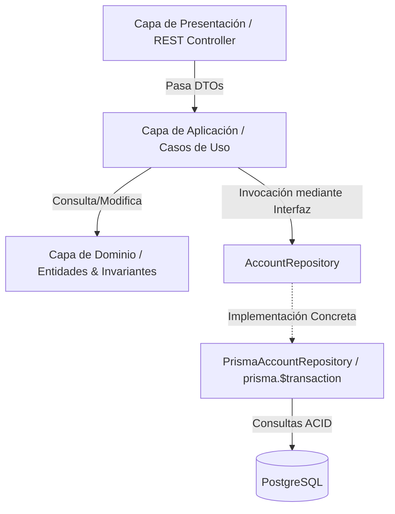
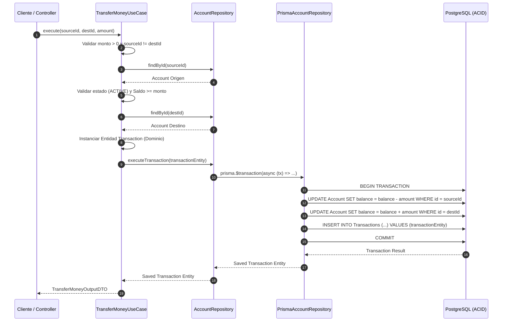

# Sesión 3: Casos de Uso Financieros y Transacciones Atómicas

**Duración**: 2 horas (30 min Teoría / 90 min Práctica)

## 1. INTRODUCCIÓN Y OBJETIVOS

¡Bienvenidos a la tercera sesión del programa! Hasta este punto hemos modelado nuestro dominio financiero (el núcleo de la aplicación) y configurado la capa de persistencia con PostgreSQL y Prisma ORM. En esta sesión subiremos a la **capa de Aplicación** o **Casos de Uso** (_Use Cases / Interactors_).

En una plataforma _Fintech_, esta capa es sumamente crítica. Es aquí donde coordinamos las reglas de negocio puras con los adaptadores de persistencia, asegurando que el dinero de los usuarios se mantenga íntegro y protegido contra fallos de red o errores de concurrencia.



**Objetivos de la sesión**:

1. Configurar el entorno de pruebas unitarias desacopladas con Vitest y TypeScript.
2. Implementar la lógica orquestadora de los casos de uso básicos de cuentas: `CreateAccountUseCase` y `GetBalanceUseCase`.
3. Diseñar e implementar el caso de uso transaccional complejo: `TransferMoneyUseCase`, dando cumplimiento estricto al requisito RF-3.3 de la Especificación de Requisitos del Sistema (SRS).
4. Asegurar la integridad de datos mediante transacciones atómicas (**ACID**) y mecanismos de protección contra condiciones de carrera (_Race Conditions_).
5. Escribir pruebas unitarias aisladas con Vitest para validar la lógica de los casos de uso sin depender de una base de datos real.

## 2. MARCO TEÓRICO: Transacciones ACID, Concurrencia y Precisión (30 min)

### 2.1. El Rol de los Casos de Uso en Clean Architecture

Los **Casos de Uso** representan las acciones concretas que un usuario o sistema puede ejecutar. Siguiendo el principio de inversión de dependencias y las reglas de Clean Architecture:

- **No contienen lógica de dominio intrínseca** (esa pertenece a las Entidades de Dominio).
- **No conocen detalles de entrega ni UI** (Express, controladores HTTP, HTML, React).
- **No conocen la implementación concreta de la base de datos** (Prisma, SQL directo, MongoDB).

Su función principal es orquestar el flujo:

$$\text{DTO (Entrada)} \longrightarrow \text{Repositorio (Lectura)} \longrightarrow \text{Entidad (Lógica/Invariante)} \longrightarrow \text{Repositorio (Escritura)}$$

### 2.2. Transacciones ACID en Operaciones Financieras

Una transferencia bancaria consta de al menos dos operaciones mutables en la base de datos:

1. Débito en la cuenta de origen: $B_{\text{origen, nuevo}} = B_{\text{origen, actual}} - \text{monto}$
2. Crédito en la cuenta de destino: $B_{\text{destino, nuevo}} = B_{\text{destino, actual}} + \text{monto}$
3. Registro de auditoría transaccional: Creación del registro en la tabla `Transaction`.

Si el sistema sufre una interrupción de energía o red después del paso 1 pero antes del paso 2, el dinero de la cuenta origen se pierde. Para evitar este escenario, en Prisma, esto se logra con `prisma.$transaction(...)`.

**¿Cómo usamos prisma.$transaction sin romper Clean Architecture?**

Para no importar `PrismaClient` dentro del Caso de Uso (`TransferMoneyUseCase`), aplicamos el **Principio de Inversión de Dependencias (DIP)**:

1. **Definición del Contrato en Dominio (`AccountRepository`)**: Declaramos un método abstracto `executeTransferTransaction(sourceAccountId, destinationAccountId, amount)` en la interfaz del repositorio. El Caso de Uso solo invoca este contrato.
2. **Implementación en Infraestructura (`PrismaAccountRepository`)**: La clase concreta en la capa de infraestructura implementa el contrato e invoca `prisma.$transaction(async (tx) => { ... })` pasando un cliente transaccional interactivo (`tx`).

De esta manera, la persistencia atómica queda encapsulada en la Infraestructura mientras la Capa de Aplicación permanece 100% libre de acoplamiento a Prisma.

### 2.3. Condiciones de Carrera (_Race Conditions_) y Bloqueo

Supongamos que una cuenta tiene un saldo inicial $B = 100 \text{ USD}$. Un usuario envía rápidamente dos solicitudes idénticas y simultáneas para transferir $100 \text{ USD}$ a diferentes receptores:

```plain
Hilo A: Lee Saldo (100 USD) -> Comprueba (100 >= 100: OK) -> Resta 100 -> Saldo = 0 USD
Hilo B: Lee Saldo (100 USD) -> Comprueba (100 >= 100: OK) -> Resta 100 -> Saldo = -100 USD
```

Este escenario representa una violación grave del invariante de dominio $B \ge 0$. Al ejecutar las actualizaciones dentro del bloque interactivo `prisma.$transaction()`, PostgreSQL maneja el aislamiento de la transacción de forma consistente.

### 2.4. Manejo de Precisión Decimal (RNF-2)

Los números de coma flotante de doble precisión (estándar IEEE 754 utilizado nativamente por el tipo `number` en JavaScript y TypeScript) sufren de imprecisiones binarias al operar fracciones decimales:

$$0.1 + 0.2 = 0.30000000000000004$$

En sistemas financieros está prohibido trabajar saldos con `number`. La regla de arquitectura impone el uso de objetos `Decimal` (provenientes de librerías como `decimal.js` o la definición integrada en Prisma) para garantizar la exactitud matemática.

## 3. DESARROLLO PRÁCTICO (90 min)

### 3.1. Configuración del Entorno de Pruebas Unitarias con Vitest

En lugar de frameworks tradicionales como Jest, utilizaremos **Vitest**, un runner de pruebas ultrarrápido basado en Vite que ofrece soporte nativo para TypeScript, ESM y ejecución paralela fuera de la caja.

#### Paso 1: Instalación de Dependencias de Desarrollo

Ejecutar en la terminal raíz del proyecto:

```bash copy
pnpm add -D vitest @vitest/coverage-v8 ts-node
```

#### Paso 2: Creación del Archivo de Configuración `vitest.config.mjs`

Crear el archivo `vitest.config.mjs` en la raíz del proyecto:

```typescript copy
import { defineConfig } from 'vitest/config';
import path from 'path';

export default defineConfig({
  test: {
    globals: true,
    environment: 'node',
    clearMocks: true,
    include: ['tests/**/*.test.ts', 'tests/**/*.spec.ts'],
    coverage: {
      provider: 'v8',
      reporter: ['text', 'json', 'html'],
      include: ['src/use-cases/**/*.ts', 'src/domain/**/*.ts'],
      exclude: ['src/**/*.d.ts'],
    },
  },
  resolve: {
    alias: {
      '@domain': path.resolve(import.meta.url, './src/domain'),
      '@use-cases': path.resolve(import.meta.url, './src/use-cases'),
      '@infrastructure': path.resolve(import.meta.url, './src/infrastructure'),
    },
  },
});
```

#### Paso 3: Configuración de Scripts en `package.json`

Añadir las tareas de prueba dentro de la sección `"scripts"` del archivo `package.json`:

```json copy
"scripts": {
  "test": "vitest run",
  "test:watch": "vitest",
  "test:coverage": "vitest run --coverage"
}
```

### 3.2. Excepciones de Dominio

Antes de crear los casos de uso, definimos las clases de excepción explícitas para evitar devolver errores genéricos o `strings` no estructurados.

Agrega al archivo `src/domain/exceptions/FinancialError.ts`:

```typescript copy
export class AccountNotFoundError extends DomainError {
  constructor(accountId: string) {
    super(`La cuenta con ID '${accountId}' no fue encontrada o no existe.`);
  }
}
```

### 3.3 Interfaz del Repositorio

Agregamos el método `executeTransferTransaction()` en la clase `AccountRepository` para ejecutar una transferencia financiera atómica entre dos cuentas. La implementación de infraestructura debe garantizar la atomicidad (p. ej. `Prisma $transaction`).

`src/domain/repositories/Repositories.ts`

```typescript copy
...
import { Decimal } from "decimal.js";

...
export interface AccountRepository {
  ...
  /**
   * Ejecuta de forma atómica cualquier transacción financiera (TRANSFER, DEPOSIT, WITHDRAWAL)
   * actualizando saldos y persistiendo la entidad de dominio Transaction.
   */
  executeTransaction(transaction: Transaction): Promise<Transaction>;
}
```

### 3.4. Casos de Uso de Lectura y Creación

#### DTOs e Interfaces

Definimos los Data Transfer Objects (DTO) de entrada y salida para desacoplar las capas externas.

`src/use-cases/dto/AccountDTOs.ts`

```typescript copy
import { Decimal } from "decimal.js";

export interface CreateAccountInputDTO {
  userId: string;
  initialBalance?: number;
}

export interface AccountOutputDTO {
  id?: string;
  accountNumber: string;
  balance: Decimal;
  status: string;
  userId: string;
  createdAt?: Date;
}

export interface GetBalanceInputDTO {
  accountId: string;
}
```

#### Implementación del `GetBalanceUseCase`

`src/use-cases/GetBalanceUseCase.ts`

```typescript copy
import { AccountRepository } from "../domain/repositories/Repositories";
import { AccountNotFoundError } from "../domain/exceptions/FinancialError";
import { GetBalanceInputDTO, AccountOutputDTO } from "./dto/AccountDTOs";

export class GetBalanceUseCase {
  constructor(private readonly accountRepository: AccountRepository) { }

  async execute(input: GetBalanceInputDTO): Promise<AccountOutputDTO> {
    const account = await this.accountRepository.findById(input.accountId);

    if (!account) {
      throw new AccountNotFoundError(input.accountId);
    }

    return {
      id: account.id,
      accountNumber: account.accountNumber,
      balance: account.balance,
      status: account.status,
      userId: account.userId,
      createdAt: account.createdAt,
    };
  }
}
```

#### Implementación del `CreateAccountUseCase`

`src/use-cases/CreateAccountUseCase.ts`

```typescript copy
import { Decimal } from "decimal.js";
import { AccountRepository } from "../domain/repositories/Repositories";
import { Account } from "../domain/entities/Account";
import { CreateAccountInputDTO, AccountOutputDTO } from "./dto/AccountDTOs";
import { InvalidAmountError } from "../domain/exceptions/FinancialError";

export class CreateAccountUseCase {
  constructor(private readonly accountRepository: AccountRepository) { }

  async execute(input: CreateAccountInputDTO): Promise<AccountOutputDTO> {
    const initialAmount = input.initialBalance ?? 0;

    if (initialAmount < 0) {
      throw new InvalidAmountError("El monto de la operación debe ser un valor estricto mayor a cero.");
    }

    const accountNumber = `ACC-${Math.floor(100000000 + Math.random() * 900000000)}`;

    const newAccount = Account.create({
      id: crypto.randomUUID(),
      accountNumber,
      balance: new Decimal(initialAmount),
      userId: input.userId,
      status: "ACTIVE",
      createdAt: new Date()
    });

    const savedAccount = await this.accountRepository.save(newAccount);

    return {
      id: savedAccount.id,
      accountNumber: savedAccount.accountNumber,
      balance: new Decimal(savedAccount.balance),
      status: savedAccount.status,
      userId: savedAccount.userId,
      createdAt: savedAccount.createdAt,
    };
  }
}
```

### 3.5. Caso de Uso Complejo: `TransferMoneyUseCase`

Este caso de uso implementa la lógica atómica definida en el RF-3.3.



`src/use-cases/dto/TransferDTOs.ts`

```typescript copy
export interface TransferMoneyInputDTO {
  sourceAccountId: string;
  destinationAccountId: string;
  amount: number;
}

export interface TransferMoneyOutputDTO {
  transactionId: string;
  sourceAccountId: string;
  destinationAccountId: string;
  amount: number;
  executedAt: Date;
}
```

`src/use-cases/TransferMoneyUseCase.ts`

```typescript copy
import { AccountRepository } from "../domain/repositories/Repositories";
import { InvalidPropValueError } from "../domain/exceptions/DomainError";
import {
  AccountNotFoundError,
  AccountFrozenError,
  InsufficientBalanceError,
  InvalidAmountError,
} from "../domain/exceptions/FinancialError";
import { TransferMoneyInputDTO, TransferMoneyOutputDTO } from "./dto/TransferDTOs";
import { Decimal } from "decimal.js";

export class TransferMoneyUseCase {
  constructor(private readonly accountRepository: AccountRepository) {}

  async execute(input: TransferMoneyInputDTO): Promise<TransferMoneyOutputDTO> {
    const { sourceAccountId, destinationAccountId, amount } = input;

    // 1. Validaciones básicas de entrada
    if (amount <= 0) {
      throw new InvalidAmountError("El monto de la transferencia debe ser estrictamente mayor a cero.");
    }

    if (sourceAccountId === destinationAccountId) {
      throw new InvalidPropValueError("La cuenta de origen y destino no pueden ser idénticas.");
    }

    const transferAmount = new Decimal(amount);

    // 2. Obtener la cuenta de origen para verificar estado e invariantes
    const sourceAccount = await this.accountRepository.findById(sourceAccountId);
    if (!sourceAccount) {
      throw new AccountNotFoundError(sourceAccountId);
    }

    // 3. Validar estado de la cuenta origen
    if (sourceAccount.status === "FROZEN") {
      throw new AccountFrozenError(sourceAccountId);
    }

    // 4. Validar invariante de saldo suficiente
    if (sourceAccount.balance.lessThan(transferAmount)) {
      throw new InsufficientBalanceError("La cuenta de origen no tiene saldo suficiente para realizar la transferencia.");
    }

    // 5. Validar existencia de la cuenta destino
    const destinationAccount = await this.accountRepository.findById(destinationAccountId);
    if (!destinationAccount) {
      throw new AccountNotFoundError(destinationAccountId);
    }

    // 6. Instanciar la Entidad de Dominio Transaction
    const transactionEntity = Transfer.create({
      amount: transferAmount,
      status: "COMPLETED",
      sourceAccountId,
      destinationAccountId,
      createdAt: new Date(),
      description: `Transferencia de ${transferAmount.toNumber()} desde la cuenta ${sourceAccountId} a la cuenta ${destinationAccountId}.`
    );

    // 7. Delegar la ejecución al repositorio pasando la entidad de dominio
    const savedTransaction = await this.accountRepository.executeTransaction(transactionEntity);

    return {
      transactionId,
      sourceAccountId,
      destinationAccountId,
      amount: transferAmount.toNumber(),
      executedAt: new Date(),
    };
  }
}
```

### 3.6. Capa de Infraestructura: Implementación de `PrismaAccountRepository` con `prisma.$transaction`

Aquí es donde encapsulamos la tecnología concreta de Prisma. Fíjate cómo el Caso de Uso nunca se entera de que estamos usando Prisma.

`src/infrastructure/repositories/PrismaAccountRepository.ts`

```typescript copy
...
import { Decimal } from "decimal.js";

export class PrismaAccountRepository implements AccountRepository {
  ...

  /**
   * Garantiza la atomicidad mediante prisma.$transaction interactivo.
   * Si cualquiera de las tres operaciones falla, PostgreSQL realiza un Rollback automático.
   */
  async executeTransferTransaction(
    sourceAccountId: string,
    destinationAccountId: string,
    amount: Decimal
  ): Promise<string> {
    return await this.prisma.$transaction(async (tx) => {
      // 1. Debitar saldo de la cuenta de origen
      await tx.account.update({
        where: { id: sourceAccountId },
        data: { balance: { decrement: amount.toNumber() } },
      });

      // 2. Acreditar saldo en la cuenta de destino
      await tx.account.update({
        where: { id: destinationAccountId },
        data: { balance: { increment: amount.toNumber() } },
      });

      // 3. Registrar el movimiento en el historial de transacciones
      const transactionRecord = await tx.transaction.create({
        data: {
          id: crypto.randomUUID(),
          amount: amount.toNumber(),
          type: "TRANSFER",
          status: "COMPLETED",
          sourceAccountId,
          destinationAccountId,
          createdAt: new Date(),
        },
      });

      return transactionRecord.id;
    });
  }
}
```

### 3.7. Pruebas Unitarias Aisladas con Mocks

Gracias a que nuestro `TransferMoneyUseCase` depende únicamente de la abstracción `AccountRepository`, podemos testear toda la lógica del Caso de Uso en milisegundos con Vitest sin levantar la base de datos PostgreSQL ni configurar Prisma Client.

`tests/use-cases/TransferMoneyUseCase.test.ts`

```typescript copy
import { describe, it, expect, beforeEach, vi } from "vitest";
import { TransferMoneyUseCase } from "../../src/use-cases/TransferMoneyUseCase";
import { AccountRepository } from "../../src/domain/repositories/Repositories";
import { Account } from "../../src/domain/entities/Account";
import {
  InsufficientBalanceError,
  AccountFrozenError,
  InvalidAmountError,
} from "../../src/domain/exceptions/FinancialError";
import { Decimal } from "decimal.js";

describe("TransferMoneyUseCase", () => {
  let mockAccountRepository: AccountRepository;
  let useCase: TransferMoneyUseCase;

  beforeEach(() => {
    mockAccountRepository = {
      findById: vi.fn(),
      save: vi.fn(),
      executeTransferTransaction: vi.fn(),
    } as unknown as AccountRepository;

    useCase = new TransferMoneyUseCase(mockAccountRepository);
  });

  it("debería transferir fondos exitosamente si todos los requisitos se cumplen", async () => {
    const sourceAcc = Account.create({
      id: "acc-1",
      accountNumber: "ACC-100",
      balance: new Decimal(500),
      userId: "user-1",
      status: "ACTIVE",
      createdAt: new Date()
    });
    const destAcc = Account.create({
      id: "acc-2",
      accountNumber: "ACC-200",
      balance: new Decimal(100),
      userId: "user-2",
      status: "ACTIVE",
      createdAt: new Date()
    });

    vi.mocked(mockAccountRepository.findById).mockImplementation(async (id) => {
      if (id === "acc-1") return sourceAcc;
      if (id === "acc-2") return destAcc;
      return null;
    });

    vi.mocked(mockAccountRepository.executeTransferTransaction).mockResolvedValue("tx-999");

    const result = await useCase.execute({
      sourceAccountId: "acc-1",
      destinationAccountId: "acc-2",
      amount: 200,
    });

    expect(result.transactionId).toBe("tx-999");
    expect(mockAccountRepository.executeTransferTransaction).toHaveBeenCalledWith(
      "acc-1",
      "acc-2",
      new Decimal(200)
    );
  });

  it("debería lanzar InvalidAmountError si el monto es menor o igual a cero", async () => {
    await expect(
      useCase.execute({ sourceAccountId: "acc-1", destinationAccountId: "acc-2", amount: 0 })
    ).rejects.toThrow(InvalidAmountError);

    expect(mockAccountRepository.findById).not.toHaveBeenCalled();
  });

  it("debería lanzar InsufficientBalanceError si la cuenta de origen no tiene saldo suficiente", async () => {
    const sourceAcc = Account.create({
      id: "acc-1",
      accountNumber: "ACC-100",
      balance: new Decimal(50),
      userId: "user-1",
      status: "ACTIVE",
      createdAt: new Date()
    });
    const destAcc = Account.create({
      id: "acc-2",
      accountNumber: "ACC-200",
      balance: new Decimal(100),
      userId: "user-2",
      status: "ACTIVE",
      createdAt: new Date()
    });

    vi.mocked(mockAccountRepository.findById).mockImplementation(async (id) => {
      if (id === "acc-1") return sourceAcc;
      if (id === "acc-2") return destAcc;
      return null;
    });

    await expect(
      useCase.execute({ sourceAccountId: "acc-1", destinationAccountId: "acc-2", amount: 100 })
    ).rejects.toThrow(InsufficientBalanceError);

    expect(mockAccountRepository.executeTransferTransaction).not.toHaveBeenCalled();
  });

  it("debería lanzar AccountFrozenError si la cuenta origen está en estado FROZEN", async () => {
    const sourceAcc = Account.create({
      id: "acc-1",
      accountNumber: "ACC-100",
      balance: new Decimal(1000),
      userId: "user-1",
      status: "FROZEN",
      createdAt: new Date()
    });
    const destAcc = Account.create({
      id: "acc-2",
      accountNumber: "ACC-200",
      balance: new Decimal(100),
      userId: "user-2",
      status: "ACTIVE",
      createdAt: new Date()
    });

    vi.mocked(mockAccountRepository.findById).mockImplementation(async (id) => {
      if (id === "acc-1") return sourceAcc;
      if (id === "acc-2") return destAcc;
      return null;
    });

    await expect(
      useCase.execute({ sourceAccountId: "acc-1", destinationAccountId: "acc-2", amount: 100 })
    ).rejects.toThrow(AccountFrozenError);
  });
});
```

Y para ejecutar las pruebas unitarias:

```bash copy
pnpm run test
```

y si desea ejecutar las pruebas unitarias con cobertura de código:

```bash copy
pnpm run test:coverage
```

## 4. PUNTOS DE CONTROL ARQUITECTÓNICOS Y MEJORES PRÁCTICAS

1. **Desacoplamiento Estricto del ORM**: Note como `TransferMoneyUseCase` no importa Prisma.
Las Transacciones Atómicas (`prisma.$transaction`) se llevaron a `PrismaAccountRepository` en la capa de Infraestructura.
2. **Principio _Fail-Fast_ (Falla Rápido)**: Las validaciones sintácticas y de precondiciones de negocio (monto válido, identificadores no vacíos, cuentas existentes) se ejecutan antes de invocar operaciones pesadas o abrir transacciones de base de datos.
3. **Tipado Estricto mediante DTOs**: Evitar pasar entidades directas del ORM o tipos implícitos entre capas. El uso de contratos explícitos (`InputDTO` / `OutputDTO`) protege la API interna contra cambios estructurales en la base de datos.
4. **Inversión de Dependencias (DIP) y Testabilidad**: Al inyectar la abstracción `AccountRepository` en el constructor del Caso de Uso, desacoplamos la lógica de la herramienta de persistencia. Esto permite verificar las reglas con pruebas unitarias rápidas sin levantar infraestructura real.
5. **Tratamiento Explícito de Excepciones**: Distinguir adecuadamente entre errores de cliente/dominio (`InsufficientBalanceError`) y fallos de infraestructura no controlados.

## 5. TAREAS Y ENTREGABLE DE LA SESIÓN

### Requisitos de entrega (branch: `step-03-usecases`)

1. **Implementación de Casos de Uso**:
    - Codificar los Casos de Uso explicados en clase: `CreateAccountUseCase`, `GetBalanceUseCase`, `TransferMoneyUseCase`.
    -Implementar el repositorio de infraestructura `PrismaAccountRepository` utilizando `prisma.$transaction`.
2. **Desarrollo Independiente (Reto Práctico)**:
    - Basándose en los requisitos **RF-3.1** y **RF-3.2** de la Especificación SRS, implementar los Casos de Uso restantes:
      - `DepositUseCase`: Recibe `accountId` y `amount`, valida el estado de la cuenta y aplica el crédito.
      - `WithdrawalUseCase`: Recibe `accountId` y `amount`, valida que el saldo disponible sea suficiente ($B \ge \text{amount}$) y que la cuenta esté activa.
      - `FreezeAccountUseCase`: Recibe `accountId`, valida que la cuenta no esté congelada y cambia su estado a `FROZEN`.
      - `UnfreezeAccountUseCase`: Recibe `accountId`, valida que la cuenta esté congelada y cambia su estado a `ACTIVE`.
3. Pruebas Unitarias:
    - Crear el archivo `tests/use-cases/CreateAccountUseCase.test.ts` con al menos 3 escenarios probados (Creación Exitosa con Balance, Sin Balance, Monto Negativo)
    - Crear el archivo `tests/use-cases/GetBalanceUseCase.test.ts` con al menos 2 escenarios probados (Cuenta Existe, Cuenta No Existe))
    - Crear el archivo `tests/use-cases/DepositUseCase.test.ts` con al menos 4 escenarios probados (Depósito Exitoso, Monto Negativo, Cuenta No Existe, Cuenta Congelada).
    - Crear el archivo `tests/use-cases/WithdrawalUseCase.test.ts` con al menos 3 escenarios probados (Retiro Exitoso, Saldo Insuficiente, Cuenta Congelada).
    - Crear el archivo `tests/use-cases/FreezeAccountUseCase.test.ts` con al menos 2 escenarios probados (Congelar Cuenta Activa, Congelar Cuenta Congelada).
    - Crear el archivo `tests/use-cases/UnfreezeAccountUseCase.test.ts` con al menos 2 escenarios probados (Descongelar Cuenta Congelada, Descongelar Cuenta Activa).
4. Control de Versiones:
    - Confirmar los cambios con `git commit` y publicar la rama `step-03-usecases` en GitHub.

---

En nuestra próxima sesión expondremos todos estos Casos de Uso a la red construyendo una **API RESTful**.

Diseñaremos los controladores HTTP, validaremos esquemas de entrada, estructuraremos los middlewares globales de excepciones y aseguraremos el acceso mediante JSON Web Tokens (JWT).
