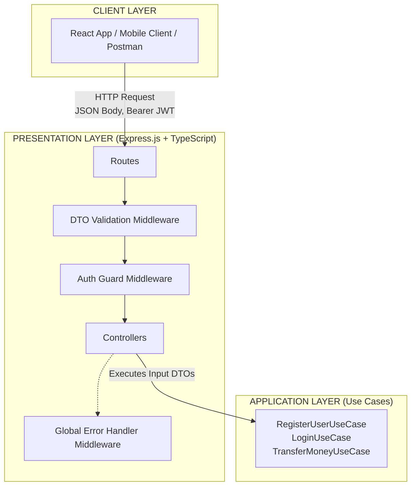
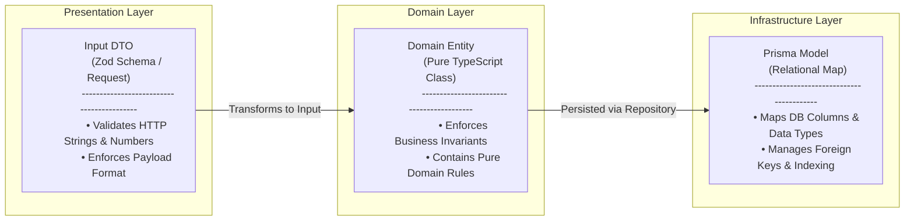
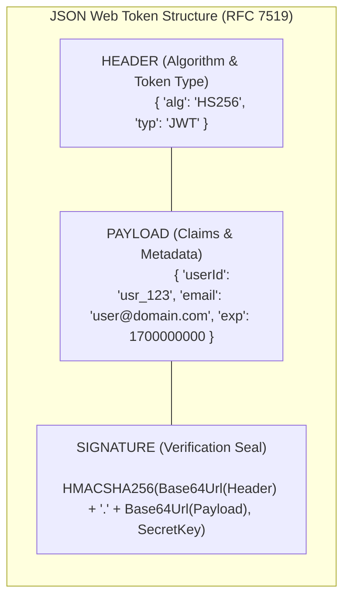
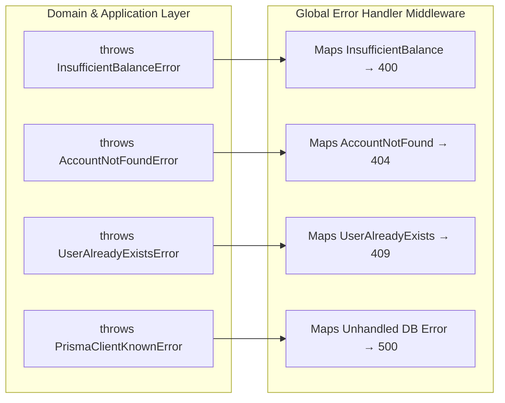

# Sesión 4: API REST, Autenticación y Seguridad

**Duración**: 2 horas (30 min Teoría / 90 min Práctica)

## 1. INTRODUCCIÓN Y OBJETIVOS

En las tres primeras sesiones construimos el núcleo transaccional del _Fintech Core System_:

- La Capa de Dominio pura e independiente (Sesión 1)
- La Capa de Infraestructura con PostgreSQL y Prisma ORM (Sesión 2)
- Los Casos de Uso con transacciones atómicas de negocio (Sesión 3).

El objetivo principal de esta sesión es exponer y proteger estos Casos de Uso hacia el mundo exterior (aplicaciones web frontend, clientes móviles o servicios de terceros) a través de una **API RESTful** segura, desacoplada, tipada e idéntica a los estándares demandados por la industria del software financiero.

Para lograr esta meta sin acoplar la lógica bancaria a marcos de trabajo HTTP como Express.js, estructuraremos la capa de presentación utilizando el patrón de **Puertos y Adaptadores (Arquitectura Hexagonal)**. La API REST actuará exclusivamente como un adaptador de entrada (_primary/driving adapter_) que recibe solicitudes de red, valida la estructura de los datos en la frontera del sistema, autentica la identidad del usuario y delega la ejecución del flujo de negocio a la capa de aplicación.



**Objetivos Específicos**:

1. **Comprender los principios de diseño de APIs RESTful**, los niveles de madurez de Richardson, la semántica HTTP, la idempotencia y la regla fundamental de separación entre DTOs, Entidades de Dominio y Modelos ORM.
2. **Implementar mecanismos de seguridad criptográfica** para el hashing defensivo de contraseñas mediante `bcrypt` y la autenticación sin estado (_stateless_) mediante `JSON Web Tokens` (JWT).
3. **Construir la Capa de Presentación** en Clean Architecture, aislando los controladores HTTP (`Controllers`), los objetos de transferencia de datos (`DTOs`) y los middlewares de Express sin contaminar las capas internas.
4. **Desarrollar un Middleware de Manejo Global de Errores** robusto que capture y traduzca excepciones de dominio y fallas conocidas de la base de datos a respuestas HTTP normalizadas, evitando la fuga de información sensible.
5. **Verificar la API REST funcional** mediante un conjunto exhaustivo de pruebas con clientes HTTP (Postman / Insomnia / cURL) para flujos de registro, login, consulta de balances y transferencias de dinero.

## 2. MARCO TEÓRICO: API REST, JWT Y SEGURIDAD EN ARQUITECTURA LIMPIA (30 min)

### 2.1 Principios de Diseño RESTful, Semántica HTTP e Idempotencia

REST (_Representational State Transfer_) es un estilo arquitectónico para sistemas distribuidos basado en la manipulación de recursos identificados mediante URIs. En una arquitectura limpia, la API REST actúa simplemente como un **adaptador conducido** (_driven adapter_) o punto de entrada en la capa de presentación.

#### Modelo de Madurez de Richardson

Para calificar una API como verdaderamente RESTful, evaluamos su avance según el Modelo de Madurez de Richardson:

- **Nivel 0 (POX/HTTP Tunneling)**: Uso de HTTP como un mero canal de transporte remotos. Peticiones de distintos propósitos apuntan a una única URL (ej. `/api/service/endpoint`) usando siempre `POST` con cargas JSON/XML personalizadas (enfoque tipo RPC/SOAP).
- **Nivel 1 (Recursos)**: Identificación de recursos individuales con URIs dedicadas y sustantivas (`/api/accounts`, `/api/transactions`, `/api/users`), abandonando el endpoint único. Sin embargo, se suele utilizar un solo verbo HTTP para todas las interacciones.
- **Nivel 2 (Verbos HTTP y Códigos de Estado)**: Uso riguroso y semántico de los métodos HTTP (`GET`, `POST`, `PUT`, `PATCH`, `DELETE`) combinados con los códigos de respuesta estándar de la IANA (`200 OK`, `201 Created`, `400 Bad Request`, `401 Unauthorized`, `404 Not Found`, etc.).
- **Nivel 3 (HATEOAS - Hypermedia As The Engine Of Application State)**: Controles hipermedia embebidos dentro de las respuestas JSON para guiar dinámicamente al cliente sobre qué acciones o transiciones de estado son válidas desde el recurso actual.

Nuestra API alcanzará un **Nivel 2 estricto**, garantizando semántica clara, contratos predecibles y un manejo impecable de encabezados y códigos de estado.

| Verbo HTTP | Recurso Objetivo | ¿Idempotente? | ¿Seguro? | Códigos de Estado Principales |
| --- | --- | --- | --- | --- |
| POST | `/api/auth/register` | No | No | `201 Created`, `400 Bad Request`, `409 Conflict` |
| POST | `/api/auth/login` | No | No | `200 OK`, `401 Unauthorized` |
| GET | `/api/accounts` | Sí | Sí | `200 OK`, `401 Unauthorized` |
| POST | `/api/accounts` | No | No | `201 Created`, `401 Unauthorized` |
| POST | `/api/transactions/transfer` | No | No | `201 Created`, `400 Bad Request`, `404 Not Found` |
| GET | `/api/transactions/history/:id` | Sí | Sí | `200 OK`, `401 Unauthorized`, `404 Not Found` |

#### Idempotencia en APIs Financieras

Una operación es **idempotente** si la ejecución repetida de la misma petición produce exactamente el mismo efecto en el estado del servidor que una sola ejecución.

- **Operaciones Seguras e Idempotentes**: `GET` y `HEAD` son operaciones de solo lectura. Consultar el saldo de una cuenta diez veces seguidas produce exactamente el mismo efecto en la base de datos (ningún cambio de estado) y retorna el mismo resultado.
- **Operaciones Idempotentes de Escritura**: `PUT`, `PATCH` y `DELETE` deben ser idempotentes por especificación. Reemplazar una dirección bancaria por la misma cadena $N$ veces deja el sistema en el mismo estado final.
- **Operaciones No Idempotentes**: `POST` no es idempotente por definición. En el contexto de transferencias de fondos (`/api/transactions/transfer`), enviar dos veces por error la misma petición HTTP (por ejemplo, por un reintento automático de red) resulta en dos registros de débito y transferencia si el sistema no implementa un mecanismo de prevención como llaves de idempotencia (_Idempotency Keys_) en los encabezados HTTP.

#### Mapeo Estándar de Códigos de Estado HTTP

- **200 OK**: Petición procesada exitosamente con payload de retorno (ej. consulta de cuentas o login correcto).
- **201 Created**: Recurso financiero creado con éxito (ej. registro de usuario, apertura de cuenta, transferencia ejecutada).
- **400 Bad Request**: Falla en la validación de entrada (DTO inválido) o violación de invariante de dominio (saldo insuficiente, monto menor o igual a cero).
- **401 Unauthorized**: Falta de autenticación, token JWT ausente, firma inválida o sesión expirada.
- **403 Forbidden**: Cliente autenticado pero carece de permisos sobre el recurso solicitado (ej. intentar consultar el historial de transacciones de una cuenta de otro cliente).
- **404 Not Found**: Identificador de recurso inexistente (cuenta origen o destino no encontrada en la base de datos).
- **409 Conflict**: Conflicto con el estado actual del sistema (correo ya registrado en la base de datos).
- **500 Internal Server Error**: Error no controlado de infraestructura (falla imprevista de red, pérdida de conexión con PostgreSQL).

### 2.2 El Tríptico de Modelos de Datos: DTO, Dominio y ORM

Un error habitual en aplicaciones mal diseñadas es reutilizar un mismo objeto o entidad para recibir la petición HTTP, ejecutar las reglas de negocio y persistir en la base de datos. Esto genera un alto acoplamiento, exponiendo campos internos de la base de datos al exterior y permitiendo vulnerabilidades graves como _Mass Assignment_ (asignación masiva no autorizada de propiedades).

En Clean Architecture aplicamos el **Tríptico de Modelos de Datos**, asegurando la separación de responsabilidades a través de tres representaciones distintas:



#### DTO (Data Transfer Object) - Capa de Presentación

- **Propósito**: Actúa como la frontera externa (_boundary_) de entrada y salida del sistema.
- **Responsabilidades**: Recibe strings, números o JSONs desde el cliente HTTP. Valida formatos sintácticos (que un correo tenga formato `@`, que un monto sea numérico y no un texto vacilante, que los UUIDs tengan 36 caracteres).
- **Tecnología**: Esquemas Zod / TypeScript interfaces planas.

#### Entidad de Dominio - Capa de Dominio

- **Propósito**: Modelo central de la aplicación con identidad y comportamiento financiero puro (`Account`, `User`, `Transaction`).
- **Responsabilidades**: Protege e impone las reglas e invariantes de negocio (ej. $B \ge 0$, validación de cuentas activas, lógica de transferencias atómicas).
- **Tecnología**: Clases puras de TypeScript sin librerías externas ni decoradores de base de datos.

#### Modelo ORM / Persistencia - Capa de Infraestructura

- **Propósito**: Mapeo relacional de las tablas y columnas físicas almacenadas en la base de datos.
- **Responsabilidades**: Gestionar llaves primarias, llaves foráneas, índices, restricciones de unicidad e integridad referencial SQL.
- **Tecnología**: Esquema de Prisma (`schema.prisma` / `@prisma/client`).

### 2.3 Seguridad Financiera: Hashing de Contraseñas con Bcrypt

En aplicaciones bancarias y fintech, **almacenar contraseñas en texto plano representa un fallo crítico de seguridad**. Tampoco es admisible el uso de funciones hash criptográficas simples y rápidas sin sal (_unsalted_) como MD5, SHA-1 o SHA-256, debido a la facilidad de vulnerarlas mediante ataques de fuerza bruta asistidos por GPU o uso de tablas _Rainbow_ precalculadas.

#### Bcrypt y Key Stretching

Bcrypt es un algoritmo de hashing defensivo basado en el cifrado Blowfish diseñado específicamente para el almacenamiento seguro de credenciales. Se destaca por dos mecanismos fundamentales:

1. **Salt Aleatorio (Sal)**: Una cadena aleatoria de 128 bits generada dinámicamente para cada contraseña antes de ser procesada. La sal se concatena con la clave, garantizando que dos usuarios con la misma contraseña (ej. `"Password123"`) tengan cadenas de hash completamente distintas en la base de datos, invalidando los ataques por tablas Rainbow.
2. **Factor de Costo ($Work\ Factor$)**: Un parámetro configurable $cost$ que incrementa exponencialmente el número de rondas de iteración aplicadas por el algoritmo:

    $$\text{Número de Iteraciones} = 2^{\text{cost}}$$

    Para un factor de costo $cost = 10$, el algoritmo ejecuta $2^{10} = 1024$ rondas de cómputo. Si configuramos $cost = 12$, se ejecutan $2^{12} = 4096$ rondas. Esto introduce un retardo intencional ($\approx 100\text{ms}$ por verificación), lo que resulta imperceptible para un usuario en login pero catastrófico para un atacante que intente probar millones de combinaciones por segundo.

    ```mermaid
    flowchart LR
        Password["Plain Password\n(e.g., 'Password123')"] --> BcryptEngine["Bcrypt Engine\n(Cost Factor = 10)"]
        Salt["128-bit Random Salt"] --> BcryptEngine
        BcryptEngine --> HashResult["Calculated Hash String\n($2b$10$e8.xQJ...u1A)"]
    ```

#### Anatomía de la Cadena Hash de Bcrypt

El resultado devuelto por `bcrypt.hash()` es una única cadena formateada en Base64 que contiene autocontenidos la versión del algoritmo, el factor de costo, la sal utilizada y el hash resultante:

$$\underbrace{\$2\text{b}\$}_{\text{Algoritmo}}\underbrace{10\$}_{\text{Costo}}\underbrace{\text{N93ey8SRW729B1283719283712938123}}_{\text{Sal (22 caracteres) + Hash Derivado (31 caracteres)}}$$

### 2.4 Autenticación Stateless con JSON Web Tokens (JWT)

Para autenticar peticiones en nuestra API RESTful, utilizaremos el estándar abierto **JSON Web Tokens (RFC 7519)**. La autenticación basada en JWT es de naturaleza _stateless_ (sin estado), lo que significa que el servidor no guarda sesiones en memoria ni requiere consultar la base de datos para verificar la identidad del cliente en cada solicitud HTTP.

#### Estructura Interna de un Token JWT

Un JWT es una cadena compacta compuesta por tres secciones codificadas en Base64URL y separadas por puntos (`.`):

$$\text{JWT} = \text{Header}.\text{Payload}.\text{Signature}$$



1. **Header (Encabezado)**: Especifica el tipo de token (`JWT`) y el algoritmo de firma simétrica utilizado (`HS256` HMAC con SHA-256) o asimétrica (`RS256`).
2. **Payload (Carga Útil)**: Contiene las declaraciones o _claims_ sobre la entidad (el usuario) y metadatos adicionales de la sesión:
    - _Claims Reservados_: `sub` (subject), `iat` (issued at / fecha de emisión), `exp` (expiration time / fecha de caducidad).
    - _Claims Personalizados_: `userId`, `email`.
    - **Regla de Seguridad Financiera**: El payload está simplemente codificado en Base64URL, **no cifrado**. Cualquier persona con acceso al token puede decodificarlo. Por tanto, **jamás se deben almacenar datos sensibles** como contraseñas, números de tarjeta de crédito, saldos o PINs en el payload del JWT.
3. **Signature (Firma Criptográfica)**: Permite validar la autenticidad e integridad del token. Se calcula tomando el Header codificado, el Payload codificado, una clave secreta del servidor (`JWT_SECRET`) y aplicando el algoritmo especificado:

    $$ \text{Signature} = \text{HMAC-SHA256}\Big(\text{Base64URL}(\text{Header}) + "." + \text{Base64URL}(\text{Payload}),\ \text{SecretKey}\Big) $$

Si un atacante modifica un solo carácter del payload en el cliente (por ejemplo, alterando su `userId`), al llegar la petición al servidor la firma no coincidirá con el re-cálculo local realizado con el `JWT_SECRET`, rechazando la petición inmediatamente con un error `401 Unauthorized`.

### 2.5 Estrategia de Manejo Global de Excepciones

En Clean Architecture, la Capa de Dominio y los Casos de Uso no conocen el concepto de solicitudes HTTP, códigos 400 o respuestas JSON. Cuando ocurre una condición anómala o una violación de regla de negocio, estas capas internas lanzan excepciones fuertemente tipadas (ej. InsufficientBalanceError, AccountNotFoundError).

El Middleware Centralizado de Manejo de Errores de Express actúa como una barrera de contención en la frontera externa del sistema. Intercepta todas las excepciones no capturadas durante la ejecución de los controladores y las traduce ordenadamente a respuestas HTTP normalizadas.



Este enfoque garantiza dos ventajas críticas:

- **Prevención de Filtración de Datos (Data Leakage)**: Evita que errores técnicos internos (como fallas de consulta SQL de PostgreSQL o trazados de pila _stack traces_) sean expuestos al cliente HTTP, reduciendo la superficie de ataque.
- **Formato Único de Respuesta**: Asegura que el cliente frontend consuma un formato estandarizado de error independientemente de qué capa haya generado la falla.

## 3. DESARROLLO PRÁCTICO (90 min)

### Paso 1: Instalación de Dependencias del Proyecto

Antes de construir los controladores y middlewares de la API REST, se deben instalar en el proyecto Node.js las dependencias de producción para el servidor web (`express`), la gestión de peticiones cruzadas (`cors`), el hashing criptográfico (`bcrypt`), la emisión/verificación de tokens (`jsonwebtoken`) y la validación de esquemas (`zod`), junto a sus respectivas definiciones de tipo para TypeScript (`@types`).

Ejecuta el siguiente comando en la raíz del proyecto backend:

#### Dependencias de producción

```bash copy
pnpm add express cors bcrypt jsonwebtoken zod
```

#### Dependencias de desarrollo (Tipos para TypeScript)

```bash copy
pnpm add -D @types/express @types/cors @types/bcrypt @types/jsonwebtoken
```

### Paso 2: Servicios de Seguridad en Infraestructura (Ports & Adapters)

Definiremos primero las interfaces (puertos) para la seguridad en la capa de dominio o aplicación, y luego crearemos las implementaciones concretas (adaptadores) en la capa de infraestructura.

```plain
src/
├── domain/
│   └── services/
│       ├── PasswordHasher.ts
│       └── TokenService.ts
├── infrastructure/
│   └── services/
│       ├── BcryptPasswordHasher.ts
│       └── JwtTokenService.ts
```

#### Puerto e Implementación del Servicio de Hashing

- Define el puerto de la interfaz de hashing de contraseñas:

  `src/domain/services/PasswordHasher.ts`:

  ```typescript copy
  /**
   * Puerto de Dominio para el servicio de hashing criptográfico.
   * Permite abstraer la lógica de contraseñas de librerías de infraestructura como bcrypt.
   */
  export interface PasswordHasher {
    /**
     * Genera un hash seguro a partir de una contraseña en texto plano.
     */
    hash(password: string): Promise<string>;

    /**
     * Compara una contraseña en texto plano con un hash almacenado para verificar la credencial.
     */
    compare(plainText: string, hash: string): Promise<boolean>;
  }
  ```

- Implementa el adaptador concreto utilizando la librería `bcrypt`

  `src/infrastructure/services/BcryptPasswordHasher.ts`:

  ```typescript copy
  import bcrypt from 'bcrypt';
  import { PasswordHasher } from '../../domain/services/PasswordHasher';

  /**
   * Adaptador de Infraestructura que implementa el servicio de hashing usando Bcrypt.
   */
  export class BcryptPasswordHasher implements PasswordHasher {
    private readonly saltRounds: number;

    /**
     * @param saltRounds Factor de costo de Bcrypt (Work Factor). Valor recomendado por defecto: 10.
     */
    constructor(saltRounds: number = 10) {
      this.saltRounds = saltRounds;
    }

    async hash(password: string): Promise<string> {
      return await bcrypt.hash(password, this.saltRounds);
    }

    async compare(plainText: string, hash: string): Promise<boolean> {
      return await bcrypt.compare(plainText, hash);
    }
  }
  ```

#### Puerto e Implementación del Servicio de Tokens JWT

- Define el puerto e interfaces para la gestión de tokens:

  `src/domain/services/TokenService.ts`

  ```typescript copy
  /**
   * Estructura del contenido (payload) almacenado dentro del token JWT.
   */
  export interface TokenPayload {
    userId: string;
    email: string;
  }

  /**
   * Puerto de Dominio para la generación y verificación de tokens de autenticación.
   */
  export interface TokenService {
    /**
     * Firma y genera un token JWT codificado con los claims provistos.
     */
    generateToken(payload: TokenPayload): string;

    /**
     * Verifica la validez y firma del token. Retorna el payload decodificado si es válido.
     */
    verifyToken(token: string): TokenPayload;
  }
  ```

- Implementa el adaptador concreto utilizando `jsonwebtoken`:

  `src/infrastructure/services/JwtTokenService.ts`

  ```typescript copy
  import jwt from 'jsonwebtoken';
  import { TokenService, TokenPayload } from '../../domain/services/TokenService';

  /**
   * Adaptador de Infraestructura que implementa la firma y verificación de JWT.
  */
  export class JwtTokenService implements TokenService {
    private readonly secretKey: string;
    private readonly expiresIn: string;

    constructor() {
      // Lectura de variables de entorno con valores por defecto seguros para entorno local
      this.secretKey = process.env.JWT_SECRET || 'default_secret';
      this.expiresIn = process.env.JWT_EXPIRES_IN || '1h';
    }

    generateToken(payload: TokenPayload): string {
      const options: jwt.SignOptions = {
        expiresIn: this.expiresIn as jwt.SignOptions['expiresIn'],
        algorithm: 'HS256'
      };

      return jwt.sign(payload, this.secretKey, options);
    }

    verifyToken(token: string): TokenPayload {
      try {
        const decoded = jwt.verify(token, this.secretKey) as jwt.JwtPayload & TokenPayload;
        return {
          userId: decoded.userId,
          email: decoded.email,
        };
      } catch (error) {
        throw new Error('Token de autenticación inválido o expirado.');
      }
    }
  }
  ```

### Paso 3: Validación de DTOs (Data Transfer Objects) con Zod

configuraremos la librería `zod` para realizar la validación estricta de esquemas en tiempo de ejecución.

#### DTOs de Autenticación (`AuthDTOs.ts`)

`src/presentation/dto/AuthDTOs.ts`

```typescript copy
import { z } from 'zod';

/**
 * Esquema de validación para el registro de un nuevo usuario en la API.
 */
export const RegisterUserSchema = z.object({
  name: z
    .string({ error: 'El nombre completo es requerido' })
    .min(3, { error: 'El nombre completo debe tener al menos 3 caracteres' })
    .max(100, { error: 'El nombre completo no puede exceder 100 caracteres' }),
  email: z
    .email({ error: 'Formato de correo electrónico inválido' }),
  password: z
    .string({ error: 'La contraseña es requerida' })
    .min(8, { error: 'La contraseña debe tener mínimo 8 caracteres' })
});

/**
 * Esquema de validación para el inicio de sesión.
 */
export const LoginSchema = z.object({
  email: z
    .email({ error: 'Formato de correo electrónico inválido' }),
  password: z
    .string({ error: 'La contraseña es requerida' })
    .min(1, { error: 'La contraseña no puede estar vacía' }),
});

// Extracción de tipos TypeScript a partir de los esquemas Zod
export type RegisterUserDTO = z.infer<typeof RegisterUserSchema>;
export type LoginDTO = z.infer<typeof LoginSchema>;
```

#### DTOs de Transacciones y Cuentas (`TransactionDTOs.ts`)

`src/presentation/dtos/TransactionDTOs.ts`

```typescript copy
import { z } from 'zod';

/**
 * Esquema de validación para la ejecución de una transferencia bancaria.
 */
export const TransferMoneySchema = z.object({
  sourceAccountId: z
    .uuid({ error: 'ID de cuenta de origen debe ser un UUID válido' }),
  destinationAccountId: z
    .uuid({ error: 'ID de cuenta de destino debe ser un UUID válido' }),
  amount: z
    .number({ error: 'El monto es requerido' })
    .positive('El monto a transferir debe ser un número estrictamente mayor a cero'),
  description: z
    .string()
    .max(100, 'La descripción no puede exceder los 100 caracteres')
    .optional(),
});

export type TransferMoneyDTO = z.infer<typeof TransferMoneySchema>;
```

#### Middleware Genérico de Validación de DTOs

Este middleware intercepta el cuerpo (`req.body`) de las peticiones entrantes y lo valida contra el esquema de Zod recibido. Si la validación falla, detiene la cadena de ejecución y responde inmediatamente con un código `400 Bad Request`.

`src/presentation/middlewares/validateRequest.ts`

```typescript copy
import { Request, Response, NextFunction } from 'express';
import { ZodObject, ZodError } from 'zod';

export const validateRequest = (schema: ZodObject) =>
  async (req: Request, res: Response, next: NextFunction): Promise<void> => {
    try {
      // Reemplaza el cuerpo de la petición por el objeto sanitizado y tipado por Zod
      req.body = await schema.parseAsync(req.body);
      next();
    } catch (error) {
      if (error instanceof ZodError) {
        res.status(400).json({
          status: 'fail',
          code: 'VALIDATION_ERROR',
          message: 'Error de validación en los datos de entrada',
          errors: error.issues.map((issue) => ({
            field: issue.path.join('.'),
            message: issue.message,
          })),
        });
        return;
      }
      next(error);
    }
  };
```

### Paso 4: Middleware de Autenticación (`AuthMiddleware`)

Este middleware actúa como un guardia de seguridad (_guard_) para interceptar todas las peticiones hacia rutas protegidas. Extrae el token del encabezado HTTP `Authorization`, verifica su firma mediante el puerto `TokenService` e inyecta la identidad del usuario en el objeto de la petición Express (`req.user`).

`src/presentation/middlewares/AuthMiddleware.ts`

```typescript copy
import { Request, Response, NextFunction } from 'express';
import { TokenService } from '../../domain/services/TokenService';

/**
 * Extensión de la interfaz de Request de Express para incluir la identidad del usuario autenticado.
 */
export interface AuthenticatedRequest extends Request {
  user?: {
    userId: string;
    email: string;
  };
}

export class AuthMiddleware {
  constructor(private readonly tokenService: TokenService) {}

  public handle = (req: AuthenticatedRequest, res: Response, next: NextFunction): void => {
    const authHeader = req.headers.authorization;

    // 1. Validar presencia del encabezado Authorization con el prefijo 'Bearer '
    if (!authHeader || !authHeader.startsWith('Bearer ')) {
      res.status(401).json({
        status: 'fail',
        code: 'UNAUTHORIZED',
        message: 'Acceso denegado. Se requiere un Bearer Token válido en la cabecera Authorization.',
      });
      return;
    }

    // 2. Extraer la cadena hash del token omitiendo el prefijo 'Bearer '
    const token = authHeader.split(' ')[1];

    try {
      // 3. Verificar el token usando el servicio desacoplado
      const payload = this.tokenService.verifyToken(token);
      
      // 4. Inyectar el payload del usuario autenticado en la petición
      req.user = payload;
      next();
    } catch (error) {
      res.status(401).json({
        status: 'fail',
        code: 'INVALID_TOKEN',
        message: 'El token de autenticación provisto es inválido o ha expirado.',
      });
      return;
    }
  };
}
```

### Paso 5: Controladores HTTP (`Controllers`)

Los controladores son responsables de recibir las peticiones HTTP (`req`), delegar la ejecución hacia los Casos de Uso correspondientes y retornar la respuesta JSON estructurada (res). No contienen lógica de negocio ni manipulan directamente la base de datos.

#### `AuthController`

`src/presentation/controllers/AuthController.ts`

```typescript copy
import { Request, Response, NextFunction } from 'express';
import { RegisterUserUseCase } from '../../use-cases/RegisterUserUseCase';
import { LoginUseCase } from '../../use-cases/LoginUseCase';

export class AuthController {
  constructor(
    private readonly registerUserUseCase: RegisterUserUseCase,
    private readonly loginUseCase: LoginUseCase
  ) {}

  register = async (req: Request, res: Response, next: NextFunction): Promise<void> => {
    try {
      const result = await this.registerUserUseCase.execute(req.body);
      res.status(201).json({
        status: 'success',
        data: result,
      });
    } catch (error) {
      next(error); // Delega el error al Middleware Global
    }
  };

  login = async (req: Request, res: Response, next: NextFunction): Promise<void> => {
    try {
      const result = await this.loginUseCase.execute(req.body);
      res.status(200).json({
        status: 'success',
        data: result,
      });
    } catch (error) {
      next(error);
    }
  };
}
```

#### `AccountController`

`src/presentation/controllers/AccountController.ts`

```typescript copy
import { Response, NextFunction } from 'express';
import { AuthenticatedRequest } from '../middlewares/AuthMiddleware';
import { GetUserAccountsUseCase } from '../../use-cases/GetUserAccountsUseCase';
import { CreateAccountUseCase } from '../../use-cases/CreateAccountUseCase';

export class AccountController {
  constructor(
    private readonly createAccountUseCase: CreateAccountUseCase,
    private readonly getUserAccountsUseCase: GetUserAccountsUseCase
  ) {}

  createAccount = async (req: AuthenticatedRequest, res: Response, next: NextFunction): Promise<void> => {
    try {
      const userId = req.user!.userId;
      const newAccount = await this.createAccountUseCase.execute({ userId });

      res.status(201).json({
        status: 'success',
        data: newAccount,
      });
    } catch (error) {
      next(error);
    }
  };

  getUserAccounts = async (req: AuthenticatedRequest, res: Response, next: NextFunction): Promise<void> => {
    try {
      // Extrae el ID del usuario directamente desde la sesión autenticada en el token
      const userId = req.user!.userId;
      const accounts = await this.getUserAccountsUseCase.execute(userId);

      res.status(200).json({
        status: 'success',
        data: accounts,
      });
    } catch (error) {
      next(error);
    }
  };

}
```

#### `TransactionController`

`src/presentation/controllers/TransactionController.ts`

```typescript copy
import { Response, NextFunction } from 'express';
import { AuthenticatedRequest } from '../middlewares/AuthMiddleware';
import { TransferMoneyUseCase } from '../../use-cases/TransferMoneyUseCase';
import { GetTransactionHistoryUseCase } from '../../use-cases/GetTransactionHistoryUseCase';

export class TransactionController {
  constructor(
    private readonly transferMoneyUseCase: TransferMoneyUseCase,
    private readonly getTransactionHistoryUseCase: GetTransactionHistoryUseCase
  ) {}

  transfer = async (req: AuthenticatedRequest, res: Response, next: NextFunction): Promise<void> => {
    try {
      const result = await this.transferMoneyUseCase.execute(req.body);

      res.status(201).json({
        status: 'success',
        message: 'Transferencia ejecutada de forma satisfactoria',
        data: result,
      });
    } catch (error) {
      next(error);
    }
  };

  getHistory = async (req: AuthenticatedRequest, res: Response, next: NextFunction): Promise<void> => {
    try {
      const { accountId } = req.params;
      const history = await this.getTransactionHistoryUseCase.execute(accountId);

      res.status(200).json({
        status: 'success',
        data: history,
      });
    } catch (error) {
      next(error);
    }
  };
}
```

#### `GetTransactionHistoryUseCase`

`src/use-cases/GetTransactionHistoryUseCase.ts`

```typescript copy
import { TransactionRepository } from "../domain/repositories/Repositories";
import { GetTransactionHistoryInputDTO, GetTransactionHistoryOutputDTO } from "./dto/TransactionHistoryDTOs";
import { Deposit, Withdrawal, Transaction, Transfer } from "../domain/entities/Transaction";

export class GetTransactionHistoryUseCase {
  constructor(private readonly transactionRepository: TransactionRepository) { }

  async execute(input: GetTransactionHistoryInputDTO): Promise<GetTransactionHistoryOutputDTO> {
    const transactions = await this.transactionRepository.findByAccountId(input.accountId);

    return {
      accountId: input.accountId,
      transactions: transactions.map((transaction: Transaction) => {
        const type = transaction instanceof Deposit
          ? 'DEPOSIT'
          : transaction instanceof Withdrawal
            ? 'WITHDRAWAL'
            : 'TRANSFER';

        const sourceAccountId=transaction instanceof Withdrawal || transaction instanceof Transfer
            ? transaction.sourceAccount
            : undefined;

        const destinationAccountId=transaction instanceof Deposit || transaction instanceof Transfer
            ? transaction.destinationAccount
            : undefined;

        return {
          id: transaction.id,
          type,
          amount: transaction.amount.toNumber(),
          status: transaction.status,
          description: transaction.description,
          createdAt: transaction.createdAt,
          sourceAccountId,
          destinationAccountId
        };
      }),
    };
  }
}
```

#### `TransactionHistoryDTOs`

`src/use-cases/dto/TransactionHistoryDTOs.ts`

```typescript copy
export interface GetTransactionHistoryInputDTO {
  accountId: string;
}

export interface TransactionHistoryItemDTO {
  id: string;
  type: 'DEPOSIT' | 'WITHDRAWAL' | 'TRANSFER';
  amount: number;
  status: 'PENDING' | 'COMPLETED' | 'FAILED';
  description: string;
  createdAt: Date;
  sourceAccountId?: string;
  destinationAccountId?: string;
}

export interface GetTransactionHistoryOutputDTO {
  accountId: string;
  transactions: TransactionHistoryItemDTO[];
}
```

### Paso 6: Middleware de Manejo Global de Errores

Este componente captura todas las excepciones no atrapadas en la aplicación. Mapea las excepciones de dominio a sus respectivos códigos de respuesta HTTP (`400`, `401`, `404`, `409`) y neutraliza los errores desconocidos de infraestructura o PostgreSQL para prevenir filtraciones de seguridad.

`src/presentation/middlewares/ErrorHandler.ts`

```typescript copy
import { Request, Response, NextFunction } from 'express';
import { Prisma } from '@prisma/client';
import { DomainError } from '../../domain/errors/DomainError';
import { InsufficientBalanceError } from '../../domain/errors/InsufficientBalanceError';
import { AccountNotFoundError } from '../../domain/errors/AccountNotFoundError';
import { UserAlreadyExistsError } from '../../domain/errors/UserAlreadyExistsError';
import { InvalidCredentialsError } from '../../domain/errors/InvalidCredentialsError';

export const errorHandler = (
  err: Error,
  _req: Request,
  res: Response,
  _next: NextFunction
): void => {
  // 1. Mapeo de Excepciones Específicas de Dominio
  if (err instanceof InsufficientBalanceError) {
    res.status(400).json({ status: 'fail', code: 'INSUFFICIENT_FUNDS', message: err.message });
    return;
  }

  if (err instanceof UserAlreadyExistsError) {
    res.status(409).json({ status: 'fail', code: 'USER_ALREADY_EXISTS', message: err.message });
    return;
  }

  if (err instanceof InvalidCredentialsError) {
    res.status(401).json({ status: 'fail', code: 'INVALID_CREDENTIALS', message: err.message });
    return;
  }

  if (err instanceof AccountNotFoundError) {
    res.status(404).json({ status: 'fail', code: 'ACCOUNT_NOT_FOUND', message: err.message });
    return;
  }

  if (err instanceof DomainError) {
    res.status(400).json({ status: 'fail', code: 'DOMAIN_VALIDATION_ERROR', message: err.message });
    return;
  }

  // 2. Mapeo de Excepciones Conocidas de Prisma (ORM / Base de Datos)
  if (err instanceof Prisma.PrismaClientKnownRequestError) {
    if (err.code === 'P2002') {
      res.status(409).json({
        status: 'fail',
        code: 'DUPLICATE_FIELD',
        message: 'Existe un conflicto con un dato único ya registrado en el sistema.',
      });
      return;
    }
    if (err.code === 'P2025') {
      res.status(404).json({
        status: 'fail',
        code: 'RESOURCE_NOT_FOUND',
        message: 'El recurso solicitado no fue encontrado en la base de datos.',
      });
      return;
    }
  }

  // 3. Fallos Inesperados / Errores de Infraestructura no Controlados
  console.error('[UNHANDLED CRITICAL ERROR]:', err);

  res.status(500).json({
    status: 'error',
    code: 'INTERNAL_SERVER_ERROR',
    message: 'Ocurrió un error interno e inesperado en el servidor. Por favor intente más tarde.',
  });
};
```

### Paso 7: Configuración del Servidor y Composición de Dependencias

Ensamblaremos la aplicación instanciando las dependencias concretas (Inyección de Dependencias manual) y registrando las rutas HTTP en Express.

`src/presentation/app.ts`

```typescript copy
import 'dotenv/config';
import express, { Application } from 'express';
import cors from 'cors';
import { PrismaPg } from '@prisma/adapter-pg';
import { PrismaClient } from '../generated/prisma/client';

// Adapters de Infraestructura
import { BcryptPasswordHasher } from '../infrastructure/services/BcryptPasswordHasher';
import { JwtTokenService } from '../infrastructure/services/JwtTokenService';
import { PrismaUserRepository } from '../infrastructure/repositories/PrismaUserRepository';
import { PrismaAccountRepository } from '../infrastructure/repositories/PrismaAccountRepository';
import { PrismaTransactionRepository } from '../infrastructure/repositories/PrismaTransactionRepository';

// Casos de Uso
import { RegisterUserUseCase } from '../use-cases/RegisterUserUseCase';
import { LoginUseCase } from '../use-cases/LoginUseCase';
import { CreateAccountUseCase } from '../use-cases/CreateAccountUseCase';
import { GetUserAccountsUseCase } from '../use-cases/GetUserAccountsUseCase';
import { GetBalanceUseCase } from '../use-cases/GetBalanceUseCase';
import { FreezeAccountUseCase } from '../use-cases/FreezeAccountUseCase';
import { UnfreezeAccountUseCase } from '../use-cases/UnfreezeAccountUseCase';
import { TransferMoneyUseCase } from '../use-cases/TransferMoneyUseCase';
import { DepositUseCase } from '../use-cases/DepositUseCase';
import { WithdrawalUseCase } from '../use-cases/WithdrawalUseCase';
import { GetTransactionHistoryUseCase } from '../use-cases/GetTransactionHistoryUseCase';

// Controllers & Middlewares
import { AuthController } from './controllers/AuthController';
import { AccountController } from './controllers/AccountController';
import { TransactionController } from './controllers/TransactionController';
import { AuthMiddleware } from './middlewares/AuthMiddleware';
import { validateRequest } from './middlewares/validateRequest';
import { errorHandler } from './middlewares/ErrorHandler';

// DTO Schemas
import { RegisterUserSchema, LoginSchema } from './dtos/AuthDTOs';
import { TransferMoneySchema } from './dtos/TransactionDTOs';

export function createApp(): Application {
  const app = express();

  // Middlewares globales de Express
  app.use(cors());
  app.use(express.json());

  // 1. Instanciación de Base de datos (Capa de Infraestructura)
  const prisma = new PrismaClient({
    adapter: new PrismaPg({
      connectionString: process.env.DATABASE_URL,
    }),
  });

  // 2. Instanciación de Servicios (Capa de Infraestructura)
  const passwordHasher = new BcryptPasswordHasher(10);
  const tokenService = new JwtTokenService();

  // 3. Instanciación de Repositorios (Capa de Infraestructura)
  const userRepository = new PrismaUserRepository(prisma);
  const accountRepository = new PrismaAccountRepository(prisma);
  const transactionRepository = new PrismaTransactionRepository(prisma);

  // 4. Instanciación de Casos de Uso (Capa de Aplicación)
  const registerUserUseCase = new RegisterUserUseCase(userRepository, passwordHasher);
  const loginUseCase = new LoginUseCase(userRepository, tokenService, passwordHasher);
  const createAccountUseCase = new CreateAccountUseCase(accountRepository);
  const getUserAccountsUseCase = new GetUserAccountsUseCase(accountRepository);
  const getBalanceUseCase = new GetBalanceUseCase(accountRepository);
  const freezeAccountUseCase = new FreezeAccountUseCase(accountRepository);
  const unfreezeAccountUseCase = new UnfreezeAccountUseCase(accountRepository);
  const transferMoneyUseCase = new TransferMoneyUseCase(accountRepository);
  const depositUseCase = new DepositUseCase(accountRepository);
  const withdrawalUseCase = new WithdrawalUseCase(accountRepository);
  const getTransactionHistoryUseCase = new GetTransactionHistoryUseCase(transactionRepository);

  // 5. Instanciación de Controladores y Guardias HTTP (Capa de Presentación)
  const authController = new AuthController(registerUserUseCase, loginUseCase);
  const accountController = new AccountController(
    createAccountUseCase,
    getUserAccountsUseCase,
    getBalanceUseCase,
    freezeAccountUseCase,
    unfreezeAccountUseCase
  );
  const transactionController = new TransactionController(
    transferMoneyUseCase,
    depositUseCase,
    withdrawalUseCase,
    getTransactionHistoryUseCase
  );
  const authMiddleware = new AuthMiddleware(tokenService);

  // 6. Definición y Enrutamiento de la API REST
  // --- Rutas Públicas (Autenticación) ---
  app.post('/api/auth/register', validateRequest(RegisterUserSchema), authController.register);
  app.post('/api/auth/login', validateRequest(LoginSchema), authController.login);

  // --- Rutas Protegidas (Cuentas) ---
  app.get('/api/accounts', authMiddleware.handle, accountController.getUserAccounts);
  app.post('/api/accounts', authMiddleware.handle, accountController.createAccount);

  // --- Rutas Protegidas (Transacciones) ---
  app.post('/api/transactions/transfer', authMiddleware.handle, validateRequest(TransferMoneySchema), transactionController.transfer);
  app.get('/api/transactions/history/:accountId', authMiddleware.handle, transactionController.getHistory);

  // 7. Middleware Global de Manejo de Errores (Obligatoriamente al final)
  app.use(errorHandler);

  return app;
}
```

Punto de entrada del servidor backend:

`src/server.ts`

```typescript copy
import { createApp } from './presentation/app';

const PORT = process.env.PORT;
const app = createApp();

app.listen(PORT, () => {
  console.log(`🚀 Fintech Core App API ejecutándose exitosamente en http://localhost:${PORT}`);
});
```

### Paso 8: Configuración de scripts en `package.json`

```json
{
  ...
  "scripts": {
    "start": "tsx watch src/server.ts",
    "build": "tsc --project tsconfig.json --outDir dist --rootDir ./src",
    ...
  }
}
```

Ahora puedes iniciar el servidor backend con:

```bash copy
pnpm start
```

y acceder a la API REST en `http://localhost:3000`.

También, puedes compilar el proyecto a JavaScript puro con:

```bash copy
pnpm build
```

y los elementos transpilados se encontrarán en la carpeta `dist/`.

## 4. PUNTOS DE CONTROL ARQUITECTÓNICOS Y MEJORES PRÁCTICAS

| Criterio de Verificación | Descripción y Regla Arquitectónica | Estado de Cumplimiento |
| --- | --- | --- |
| **Aislamiento del Framework Express** | Las capas de Dominio y Casos de Uso no contienen referencias ni importaciones de `express`, `req` ni `res`. | Cumplido |
| **Validación en la Frontera (Edge Validation)** | Zod inspecciona y limpia el cuerpo de las peticiones HTTP antes de que los datos toquen los Casos de Uso. | Cumplido |
| **Seguridad en Credenciales** | Bcrypt opera con factor de costo $10$. Las contraseñas en texto plano nunca se persisten ni se envían en logs. | Cumplido |
| **Autenticación Stateless con JWT** | Verificación de firma simétrica HMAC-SHA256 en el `AuthMiddleware` sin consultar la base de datos por petición. | Cumplido |
| **Manejo Seguro de Excepciones** | Traducción estandarizada de excepciones de dominio a códigos HTTP (`400`, `401`, `404`, `409`) ocultando los detalles de PostgreSQL. | Cumplido |

## 5. TAREAS Y ENTREGABLE DE LA SESIÓN

### Entregables Requeridos

1. **API REST Operativa**: Servidor backend corriendo en Node.js + TypeScript con rutas expuestas en `/api/auth/*`, `/api/accounts/*` y `/api/transactions/*`
    - **GET `/api/accounts/:accountId/balance`**: Retorna el balance actual de la cuenta especificada.
    - **PATCH `/api/accounts/:accountId/freeze`**: Congela la cuenta especificada.
    - **PATCH `/api/accounts/:accountId/unfreeze`**: Descongela la cuenta especificada.
    - **POST `/api/transactions/deposit`**: Permite realizar un depósito en la cuenta especificada.
    - **POST `/api/transactions/withdrawal`**: Permite realizar un retiro de la cuenta especificada.
2. Pruebas unitarias y de integración para los Casos de Uso y Repositorios.
3. Control de Versiones:
    - Confirmar los cambios con `git commit` y publicar la rama `step-04-api` en GitHub.
4. **Colección de Postman / Insomnia**: Archivo `.json` exportado con el conjunto completo de peticiones estructuradas en carpetas por módulo.

### Guía de Verificación Paso a Paso con cURL y Respuestas Esperadas

1. **Registro de Usuario Inicial**

    ```bash copy
    curl -X POST http://localhost:3000/api/auth/register \
      -H "Content-Type: application/json" \
      -d '{
        "name": "Carlos Mendoza",
        "email": "carlos@fintech.com",
        "password": "Password123"
      }'
    ```

    _Respuesta Esperada (`201 Created`)_:

    ```json
    {
      "status": "success",
      "data": {
        "userId": "d290f1ee-6c54-4b01-90e6-d701748f0851",
        "email": "carlos@fintech.com",
        "accountNumber": "ACC-891024-X"
      }
    }
    ```

2. **Autenticación (Login) para Obtener Token JWT**

    ```bash copy
    curl -X POST http://localhost:3000/api/auth/login \
      -H "Content-Type: application/json" \
      -d '{
        "email": "carlos@fintech.com",
        "password": "Password123"
      }'
    ```

    _Respuesta Esperada (`200 OK`)_:

    ```json
    {
      "status": "success",
      "data": {
        "token": "eyJhbGciOiJIUzI1NiIsInR5cCI6IkpXVCJ9...",
        "user": {
          "id": "d290f1ee-6c54-4b01-90e6-d701748f0851",
          "email": "carlos@fintech.com"
        }
      }
    }
    ```

3. **Consulta de Cuentas Asociadas (Ruta Protegida)**

    ```bash copy
    curl -X GET http://localhost:3000/api/accounts \
      -H "Authorization: Bearer <TOKEN_JWT_OBTENIDO_EN_LOGIN>"
    ```

    _Respuesta Esperada (`200 OK`)_:

    ```json
    {
      "status": "success",
      "data": [
        {
          "id": "a111f1ee-6c54-4b01-90e6-d701748f0899",
          "accountNumber": "ACC-891024-X",
          "balance": 0.00,
          "status": "ACTIVE"
        }
      ]
    }
    ```

4. **Ejecución de Transferencia Atómica entre Cuentas**

    ```bash copy
    curl -X POST http://localhost:3000/api/transactions/transfer \
      -H "Authorization: Bearer <TOKEN_JWT_OBTENIDO_EN_LOGIN>" \
      -H "Content-Type: application/json" \
      -d '{
        "sourceAccountId": "a111f1ee-6c54-4b01-90e6-d701748f0899",
        "destinationAccountId": "b222f1ee-6c54-4b01-90e6-d701748f0777",
        "amount": 150.50,
        "description": "Pago por servicios profesionales"
      }'
    ```

    _Respuesta Esperada (`201 Created`)_:

    ```json
    {
      "status": "success",
      "message": "Transferencia ejecutada de forma satisfactoria",
      "data": {
        "transactionId": "t333f1ee-6c54-4b01-90e6-d701748f0555",
        "status": "COMPLETED"
      }
    }
    ```

5. **Prueba de Error por Saldo Insuficiente**

    ```bash copy
    curl -X POST http://localhost:3000/api/transactions/transfer \
      -H "Authorization: Bearer <TOKEN_JWT_OBTENIDO_EN_LOGIN>" \
      -H "Content-Type: application/json" \
      -d '{
        "sourceAccountId": "a111f1ee-6c54-4b01-90e6-d701748f0899",
        "destinationAccountId": "b222f1ee-6c54-4b01-90e6-d701748f0777",
        "amount": 999999.00,
        "description": "Monto superior al saldo"
      }'
    ```

    _Respuesta Esperada (`400 Bad Request`)_:

    ```json
    {
      "status": "fail",
      "code": "INSUFFICIENT_FUNDS",
      "message": "Saldo insuficiente para completar la transferencia."
    }
    ```

---

En nuestra próxima sesión damos inicio al Módulo 3 (Arquitectura Frontend).

Configuraremos la arquitectura del cliente en **React + TypeScript con Vite**, aplicando la separación entre componentes de presentación y servicios, e implementando el cliente Axios con interceptores para inyección de JWT y control de flujo de autenticación.
