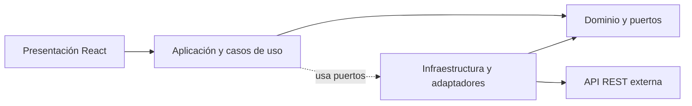
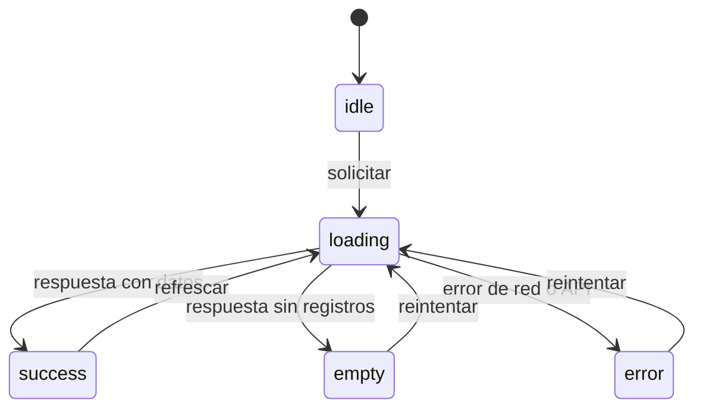
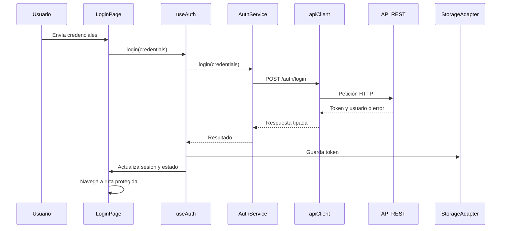
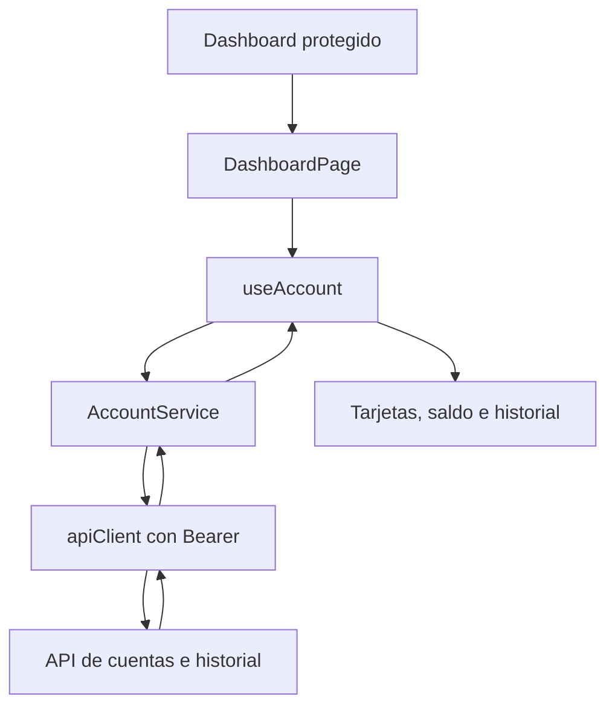
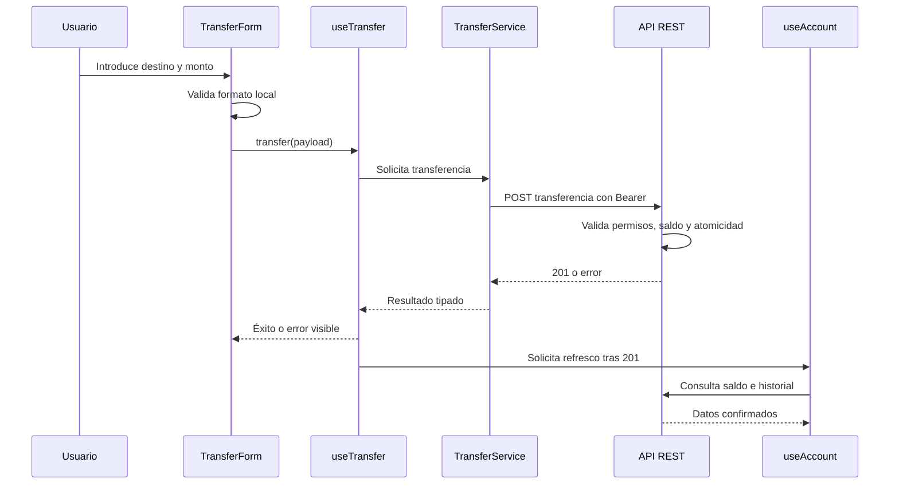

# Sesión 5: Clean Architecture en el Frontend e Integración con React

**Duración**: 120 minutos (75 min de teoría / 35 min de práctica asistida por IA)

**Módulo**: Arquitectura Frontend con React y TypeScript

## 1. Propósito de la sesión

En las sesiones anteriores se construyó el backend de la _Fintech Core App_: el dominio financiero, la persistencia con PostgreSQL, los casos de uso y la API REST protegida. En esta sesión se estudia cómo construir el frontend sin trasladar indiscriminadamente la lógica del backend a los componentes de React.

El objetivo no es aprender a colocar archivos en carpetas arbitrarias. El objetivo es comprender cómo aplicar los principios de Clean Architecture en una aplicación frontend: proteger las decisiones de presentación, controlar las dependencias, separar la interfaz de la infraestructura y diseñar una aplicación funcional que cubra todos los casos de uso publicados por el backend.

La implementación práctica será realizada por un agente de IA mediante prompts controlados. El estudiante deberá comprender la arquitectura, revisar las decisiones del agente y validar que el código generado respete los límites definidos.

## 2. Objetivos de aprendizaje

Al finalizar la sesión, el estudiante podrá:

1. Explicar la Regla de Dependencia y la Inversión de Dependencias aplicadas a React.
2. Diferenciar responsabilidades entre componentes de presentación, páginas, hooks, servicios HTTP, adaptadores y tipos.
3. Separar el estado local de una interacción, el estado global de sesión y el estado remoto proveniente de la API.
4. Diseñar el flujo de autenticación sin exponer JWT, Axios ni `localStorage` a los componentes visuales.
5. Diseñar un dashboard que represente correctamente los estados `idle`, `loading`, `success`, `error` y `empty`.
6. Integrar los casos de uso de autenticación, cuentas y transacciones respetando la autoridad del backend sobre identidad, saldo, permisos y atomicidad.
7. Preparar reglas, comandos y skills compatibles con Cursor AI para que el Agent implemente el frontend de forma consistente.
8. Auditar código generado por IA mediante criterios arquitectónicos, de seguridad, tipado y validación.

## 3. Relación con los requisitos del sistema

| Concepto de la clase | Requisito relacionado | Evidencia esperada |
| --- | --- | --- |
| Auth | Registro y login | Formularios, sesión, token encapsulado y rutas protegidas |
| Account | Crear, consultar, congelar y descongelar | Dashboard, estado de cuenta y acciones autorizadas |
| Transaction | Depósito, retiro y transferencia | Formularios, historial, errores y refresco confirmado |
| Feedback asincrónico | RNF-4 | Carga, errores, botón bloqueado y estados vacíos |
| Separación arquitectónica | RNF-1 | Componentes sin Axios, JWT ni reglas financieras |

La fuente de verdad para el frontend será el código backend existente: rutas, controladores, DTOs, casos de uso, middlewares, tipos y pruebas. La documentación de este curso sirve como contexto pedagógico, pero no debe tratarse como contrato técnico cuando no esté disponible en el contexto de Cursor. Si el backend no permite confirmar un endpoint, una propiedad o un código HTTP, el agente debe detenerse y solicitar una decisión; no debe inventarlo.

## 4. Idea central: Clean Architecture en el frontend

Clean Architecture no es una plantilla fija de carpetas ni una obligación de copiar las capas del backend. Es un conjunto de principios para controlar dependencias y proteger las decisiones importantes del sistema.

En el frontend, las decisiones importantes incluyen:

- Qué información se muestra y bajo qué estados.
- Cómo se representan las interacciones del usuario.
- Qué datos necesita una vista.
- Cómo se transforma una respuesta de la API para presentarla.
- Cómo se conserva la sesión.
- Qué ocurre cuando una petición falla.
- Cuándo se considera confirmada una operación financiera.

React, Axios, React Router, `localStorage` y Tailwind son detalles técnicos que pueden cambiar. La arquitectura debe evitar que esos detalles contaminen todos los componentes de la aplicación.

### 4.1. La Regla de Dependencia

La Regla de Dependencia establece que las dependencias del código deben apuntar hacia políticas más estables y hacia el interior de la arquitectura.

Una interpretación útil para el frontend es:



La dirección de las dependencias debe ser intencional. La presentación puede invocar casos de uso; el núcleo depende de puertos; la infraestructura implementa esos puertos. Un componente visual no debe conocer la URL, configurar headers ni leer directamente un JWT.

La regla no significa que todas las dependencias deban ser abstractas. Significa que cada dependencia debe estar ubicada en el límite correcto.

### 4.2. Capas y responsabilidades

#### Presentación: componentes, páginas, hooks y router

La presentación convierte estado en interfaz y eventos del usuario en intenciones.

Un componente de presentación puede:

- Renderizar datos recibidos por props.
- Mostrar un estado de carga, error o vacío.
- Capturar valores de un formulario.
- Emitir eventos como `onSubmit`, `onRetry` o `onLogout`.

No debería:

- Importar Axios.
- Leer `localStorage`.
- Construir headers `Authorization`.
- Decidir si una cuenta tiene saldo suficiente.
- Conocer la URL de un endpoint.
- Convertir una respuesta HTTP cruda en una decisión financiera.

Una página puede coordinar una pantalla y utilizar hooks, pero debe evitar convertirse en un servicio HTTP disfrazado.

#### Aplicación: casos de uso y puertos

Esta capa contiene los casos de uso del frontend y los puertos que necesita para ejecutarlos. No depende de React, Axios, React Router ni `localStorage`.

Ejemplos de casos de uso:

- `Login` y `Register`.
- `LoadAccounts` y `ChangeAccountStatus`.
- `Deposit`, `Withdraw`, `Transfer` y `LoadTransactions`.

Los puertos expresan capacidades, por ejemplo `AuthGateway`, `AccountGateway` o `StoragePort`. La aplicación depende de esos contratos; la infraestructura proporciona sus implementaciones.

Los hooks personalizados pertenecen a la presentación. Conectan el ciclo de vida de React con los casos de uso y traducen sus resultados a estados de UI.

Ejemplos:

- `useAuth`: inicia sesión, cierra sesión y expone el estado de autenticación.
- `useAccount`: crea, consulta, congela y descongela cuentas.
- `useTransaction`: ejecuta depósitos, retiros y transferencias, y expone sus estados.

Un hook puede saber que existe una operación de autenticación, cuenta o transacción, pero no debería contener reglas que solo el backend puede garantizar. Su función es coordinar estado, errores, cancelación, refresco e interacción con la vista.

#### Dominio: entidades y contratos estables

Esta capa contiene entidades, value objects cuando aporten valor y contratos de puertos. No debe importar React ni detalles HTTP. No es una copia automática de todas las entidades de base de datos.

Los DTOs propios del transporte deben permanecer en infraestructura y convertirse mediante adaptadores a modelos de dominio o de aplicación.

Conviene distinguir:

- **DTO de entrada**: datos que el frontend envía, por ejemplo `LoginDTO` o `TransferDTO`.
- **Respuesta de API**: forma recibida desde el backend.
- **Modelo de presentación**: forma que la UI necesita para renderizar.

Si las formas son diferentes, un mapper debe transformar una en otra. Esto evita que una decisión accidental del backend se propague por todos los componentes.

#### Infraestructura: adaptadores concretos

La infraestructura contiene detalles sustituibles:

- Cliente Axios.
- Interceptores.
- Adaptador de almacenamiento.
- Adaptadores HTTP de autenticación, cuentas y transacciones.
- Lectura de variables de entorno.

Un adaptador HTTP implementa un puerto de aplicación, traduce una intención a una petición HTTP y transforma la respuesta externa. No debe administrar estados visuales ni renderizar mensajes.

Una estructura orientativa, expresada por límites y no por nombres obligatorios, es:

```text
src/
├── domain/                    # Entidades, value objects y puertos
├── application/               # Casos de uso y resultados de aplicación
├── infrastructure/            # Axios, almacenamiento y adaptadores HTTP
├── presentation/              # React: components, pages, hooks, context y router
└── config/                    # Configuración externa consumida por infrastructure
```

La regla verificable es que `domain` no importe capas externas, `application` solo dependa de `domain`, `infrastructure` implemente los puertos y `presentation` invoque casos de uso sin conocer sus detalles técnicos. Las carpetas ayudan, pero los imports son la frontera real.

### 4.3. Inversión de Dependencias

Un componente no debería depender de la implementación concreta de Axios. El componente depende de una capacidad: `login`, `loadAccount` o `transfer`.

La inversión de dependencias se observa cuando:

```text
LoginPage -> useAuth -> Login -> AuthGateway <- HttpAuthAdapter -> apiClient -> API REST
```

La página depende de la capacidad que expone `useAuth`, y el caso de uso depende de `AuthGateway`, no del transporte. En pruebas, el gateway puede reemplazarse por un mock sin levantar la API completa.

En un proyecto pequeño no es necesario crear una interfaz para cada función solo para aparentar arquitectura. La abstracción debe resolver un cambio real, facilitar una prueba o proteger un límite importante.

### 4.4. UI declarativa y separación de responsabilidades

React permite describir qué debe verse para un estado determinado. Esa característica favorece una arquitectura explícita:

```text
estado de la aplicación -> estado de la pantalla -> interfaz renderizada
```

Por ejemplo:

```text
loading  -> indicador y controles deshabilitados
success  -> saldo e historial
error    -> mensaje y acción de reintento
empty    -> explicación y acción para continuar
```

El componente no debería intentar adivinar el estado a partir de variables dispersas que pueden entrar en combinaciones imposibles. Es preferible modelar estados explícitos o definir claramente sus invariantes.

## 5. Tres tipos de estado en el frontend

### 5.1. Estado local

Pertenece a una interacción concreta:

- Texto introducido en un formulario.
- Campo actualmente enfocado.
- Modal abierto o cerrado.
- Mensaje de validación local.

No debe convertirse en estado global solo porque varios componentes estén cerca en el árbol.

### 5.2. Estado global de sesión

Representa información transversal:

- Usuario autenticado.
- Estado de inicialización de la sesión.
- Acción de cierre de sesión.

`AuthProvider` puede exponer este estado mediante Context API. El contexto no debe transformarse en un almacén para todas las consultas del sistema.

### 5.3. Estado remoto

Es información cuya autoridad está fuera del navegador:

- Cuentas.
- Saldo.
- Historial.
- Resultado de una transferencia.

El frontend puede conservar una copia temporal para renderizar, pero el backend sigue siendo la fuente de verdad. Después de una mutación financiera exitosa, el dashboard debe volver a consultar o invalidar los datos afectados.

### 5.4. Máquina de estados asincrónica

Una consulta de cuenta debería poder describirse así:



Cada estado debe tener una representación comprensible y una acción posible. El estado `error` no debe ocultarse con una pantalla vacía, y el estado `empty` no debe tratarse como un error técnico.

## 6. Flujo de autenticación



Responsabilidades:

- `LoginPage`: formulario, accesibilidad, validación básica y navegación.
- `useAuth`: estado de la operación y coordinación del resultado.
- `AuthService`: contrato HTTP de autenticación.
- `apiClient`: base URL, timeout, headers e interceptor.
- `StorageAdapter`: acceso encapsulado al almacenamiento.
- Backend: credenciales, hash, vigencia y firma del JWT.

### 6.1. Almacenamiento del token

Para el alcance didáctico se utilizará `localStorage` únicamente detrás de `StorageAdapter`. Esto facilita observar la persistencia de sesión, pero el token es accesible para JavaScript y queda expuesto si existe una vulnerabilidad XSS.

`sessionStorage` reduce la persistencia, pero no elimina el riesgo XSS. Las cookies `HttpOnly` reducen la exposición del token a JavaScript, aunque requieren configuración de CORS, `SameSite` y protección CSRF en el backend.

La decisión didáctica no debe presentarse como recomendación universal de producción.

### 6.2. Protección de rutas

`AuthGuard` es un componente de ruta, no un HOC, cuando utiliza `Outlet` de React Router. Su responsabilidad es decidir si una ruta protegida puede renderizarse:

1. Mientras se restaura la sesión, muestra un estado de inicialización.
2. Si no existe sesión válida, redirige a `/login` con reemplazo de historial.
3. Si existe sesión, renderiza el `Outlet`.

La protección visual no reemplaza la autorización del backend. Un usuario puede modificar el navegador; cada endpoint protegido debe validar el JWT en el servidor.

## 7. Flujo del dashboard financiero



El dashboard debe mostrar, como mínimo:

- Saldo con precisión y formato monetario.
- Número y estado de la cuenta.
- Historial ordenado según el contrato de la API.
- Carga inicial.
- Error con opción de reintento.
- Estado vacío sin movimientos o sin cuentas.

El formato monetario es una responsabilidad de presentación. El cálculo del saldo y la precisión financiera pertenecen al backend y al modelo de datos.

## 8. Flujo de transferencia

Una transferencia financiera sigue esta secuencia:



Reglas importantes:

- El frontend valida formato, campos obligatorios y monto positivo.
- El backend valida saldo, cuentas activas, autorización y atomicidad.
- El frontend no calcula el nuevo saldo.
- El saldo no se actualiza de forma optimista para simular éxito.
- Tras una respuesta exitosa, se vuelven a consultar los datos afectados.
- Durante el envío se bloquea el formulario para evitar solicitudes duplicadas.
- Un error de saldo insuficiente o cuenta inexistente debe mostrarse como error de negocio, no como error genérico de red.

## 9. Antipatrones que se deben evitar

### Componente con Axios directo

```text
DashboardPage -> axios.get('/accounts')
```

Esto mezcla presentación, transporte y manejo de errores. La página queda difícil de probar y cada pantalla termina configurando la red de forma distinta.

### JWT repartido por la interfaz

Leer `localStorage` desde múltiples componentes hace que cambiar la estrategia de sesión sea costoso y aumenta el riesgo de exposición accidental.

### Reglas financieras en React

Una condición como `balance >= amount` puede mejorar la experiencia, pero nunca reemplaza la validación del backend. El valor mostrado por el navegador puede estar desactualizado o manipulado.

### Un contexto global para todo

Guardar autenticación, cuentas, modales, formularios, notificaciones e historial en un único contexto provoca renders innecesarios y límites poco claros.

### Estado remoto duplicado

Si el saldo vive simultáneamente en el contexto, la página, el modal y varias variables locales, una respuesta nueva puede dejar la interfaz inconsistente.

### Actualización optimista del saldo

Puede ser adecuada para algunas experiencias no financieras, pero en este curso se prioriza consistencia confirmada por el servidor. El saldo se refresca después de la respuesta exitosa.

### `any` en los contratos

`any` oculta cambios incompatibles entre API, servicio y UI. Los errores externos deben estrecharse con `unknown` y una función de normalización.

## 10. Alcance funcional completo del frontend

El frontend no se considera terminado después de implementar únicamente login, dashboard y transferencia. El agente debe descubrir todos los casos de uso publicados por el backend y convertirlos en capacidades accesibles desde la interfaz.

### 9.1. Auth

- Registro de usuario.
- Login.
- Restauración de sesión.
- Logout.
- Manejo de credenciales inválidas, email duplicado y validaciones de registro.
- Protección de rutas y manejo de sesión expirada.

### 9.2. Account

- Crear una cuenta financiera.
- Consultar cuentas del usuario.
- Consultar saldo, número y estado de cuenta.
- Visualizar dashboard financiero.
- Congelar una cuenta.
- Descongelar una cuenta.
- Reflejar qué operaciones están permitidas según el estado `ACTIVE` o `FROZEN`.
- Mostrar estados de carga, error, vacío y confirmación.

### 9.3. Transaction

- Depositar fondos.
- Retirar fondos.
- Transferir fondos entre cuentas.
- Consultar historial de transacciones.
- Diferenciar créditos, débitos, estados y detalles según el contrato real.
- Actualizar saldo e historial después de cada operación confirmada por el backend.
- Bloquear envíos duplicados y mostrar errores de negocio recuperables.

### 9.4. Descubrimiento de casos adicionales

La lista anterior representa el alcance mínimo solicitado. El Prompt 1 debe revisar todas las rutas, controladores y casos de uso del backend. Si descubre operaciones adicionales, como perfil, cambio de contraseña, paginación, búsqueda o notificaciones, debe agregarlas a `backend-contract.md` y `frontend-workflows.md`, clasificarlas por módulo y crear una tarea de implementación. No debe ignorarlas por no aparecer en esta lista.

Cada caso de uso descubierto debe documentarse con:

- Nombre y módulo.
- Actor y precondiciones.
- Ruta y método HTTP.
- DTO de entrada.
- Respuesta exitosa.
- Errores y códigos HTTP observados.
- Estado de UI necesario.
- Acción de refresco o invalidación posterior.
- Componentes, hook y servicio que lo implementarán.

## 11. Preparación de Cursor AI: documentos base, reglas, comandos, skills y prompts

La personalización del agente también forma parte de la arquitectura de trabajo. En Cursor, el mecanismo principal para las reglas persistentes del proyecto es `.cursor/rules/`. Los prompts de esta sesión están pensados para ejecutarse en el modo **Agent**, usando referencias explícitas con `@` y trabajando en incrementos pequeños y verificables.

| Mecanismo | Uso recomendado |
| --- | --- |
| `.cursor/rules/*.mdc` | Reglas persistentes del proyecto. Usan front-matter con `description`, `globs` y `alwaysApply` |
| `.cursor/commands/*.md` | Comandos reutilizables para tareas puntuales invocadas desde el chat de Cursor |
| `.cursor/skills/<nombre>/SKILL.md` | Workflow reutilizable de varios pasos, si la versión de Cursor habilita skills de proyecto |
| Cursor Agent | Implementación iterativa con lectura del contexto, edición de archivos y validación |
| `@archivo` o `@carpeta` | Referencia explícita al contexto que el Agent debe leer antes de actuar |

### 11.1. Documentos generados a partir del backend

Antes de crear reglas o pedir código frontend, Cursor debe generar una pequeña base de conocimiento dentro del repositorio. Estos documentos no reemplazan al backend: hacen explícitas sus decisiones para que el trabajo del frontend sea repetible y auditable.

Ubicación recomendada:

```text
docs/frontend/
├── backend-contract.md       # Rutas, métodos, autenticación, DTOs y respuestas observadas
├── frontend-architecture.md  # Capas, límites, dependencias y decisiones del frontend
├── frontend-state.md         # Sesión, estado local, estado remoto y estados asincrónicos
├── frontend-workflows.md     # Todos los casos de uso vistos desde el cliente
└── frontend-validation.md    # Comandos, pruebas, criterios de aceptación y bloqueos
```

El agente debe generar estos documentos leyendo el código real del backend. Debe indicar el archivo y símbolo que justifican cada decisión, distinguir hechos observados de inferencias y marcar como `[PENDIENTE]` todo dato que no pueda comprobar.

### 11.2. Documentos de instrucciones para la IA

Después de generar y revisar los documentos base, Cursor puede crear las personalizaciones del proyecto:

```text
.cursor/
├── rules/
│   ├── frontend-architecture.mdc
│   ├── frontend-react.mdc
│   └── frontend-services.mdc
├── commands/
│   ├── frontend-feature.md
│   ├── frontend-api-contract.md
│   └── frontend-audit.md
└── skills/
    ├── frontend-feature/SKILL.md
    └── frontend-api-contract/SKILL.md
```

Los archivos de `.cursor/` deben referenciar `docs/frontend/` y el código backend, no repetir contratos manualmente. Si la instalación de Cursor no soporta skills de proyecto, el workflow equivalente debe quedar en `.cursor/commands/`.

Una regla debe tener alcance limitado. Usa `alwaysApply: true` solo para principios realmente globales y `globs` específicos para React, servicios o tests. No confundas una regla persistente con un prompt de implementación. Si la versión de Cursor no reconoce skills, conserva el workflow como un comando en `.cursor/commands/` y documenta esa decisión.

### Forma de trabajo en Cursor Agent

Cada prompt de esta sesión debe ejecutarse en modo Agent con este ciclo:

1. Referenciar el contexto con `@docs/frontend/backend-contract.md`, `@docs/frontend/frontend-architecture.md` y los archivos de código afectados.
2. Pedir primero inspección y un plan corto; el Agent no debe editar mientras existan contratos ambiguos.
3. Autorizar un bloque pequeño de cambios.
4. Revisar el diff generado en Cursor.
5. Ejecutar las validaciones reales del proyecto.
6. Continuar con el siguiente prompt solo si el bloque anterior está validado.

El Agent debe informar qué archivos leyó, qué archivos cambió, qué comandos ejecutó y qué bloqueos permanecen. No se deben aceptar cambios basados únicamente en que la aplicación "parece funcionar".

### Reglas mínimas para el agente

- Leer `docs/frontend/backend-contract.md` y `docs/frontend/frontend-architecture.md` antes de crear servicios.
- No inventar endpoints, DTOs, propiedades ni códigos HTTP.
- Mantener la dirección de dependencias definida en esta sesión.
- No importar Axios, React Router ni `localStorage` desde componentes de presentación salvo una razón documentada.
- No colocar reglas financieras en el frontend.
- Usar TypeScript estricto y evitar `any`.
- Separar estado local, global y remoto.
- Implementar estados `loading`, `error`, `empty` y `success`.
- Ejecutar typecheck, lint y pruebas después de cada bloque significativo.
- Detenerse si el contrato del backend es ambiguo.

## 12. Práctica asistida por IA

Los siguientes prompts deben ejecutarse en orden. Cada uno está diseñado para ser copiado en Cursor Agent y revisado por el estudiante antes de continuar. Los dos primeros son obligatorios: uno genera los documentos técnicos desde el backend y el otro crea los documentos de instrucciones para la IA.

### Prompt 1: Analizar el backend y generar documentos base del frontend

```text
Actúa como arquitecto frontend senior dentro de Cursor AI. Trabaja en modo Agent y modifica el repositorio únicamente cuando el objetivo y el alcance estén claros.

Objetivo:
Analizar el backend existente de Fintech Core App y generar los documentos técnicos base que el frontend necesita para implementarse respetando Clean Architecture. En esta etapa no implementes React, no crees reglas de Cursor y no inventes endpoints.

Fuente de verdad obligatoria:
- El código backend existente en el repositorio.
- Sus rutas, controladores, DTOs, casos de uso, middlewares, tipos, configuración y pruebas.

No uses como contrato técnico:
- Documentos Markdown del curso.
- SRS, planes, ejemplos o documentación que no esté disponible en el contexto actual de Cursor.
- Suposiciones basadas en nombres de carpetas.

Comienza localizando el backend real. Identifica su carpeta raíz, package.json, tsconfig, punto de entrada, rutas, controladores, DTOs, middlewares de autenticación, casos de uso y pruebas. Usa referencias @archivo y @carpeta para trabajar con esos archivos.

Analiza:
1. Qué backend existe y cuál es su estructura real.
2. Qué rutas, métodos HTTP, parámetros, DTOs, respuestas, códigos HTTP y errores están realmente implementados.
3. Cómo se autentican y autorizan las peticiones.
4. Qué casos de uso del backend consumirá el frontend. Como mínimo, clasifica Auth (registro y login), Account (crear, consultar, congelar y descongelar) y Transaction (depósito, retiro, transferencia e historial). Incluye cualquier caso adicional descubierto.
5. Qué comandos existen para instalar, desarrollar, compilar, validar y probar el backend.
6. Qué decisiones de Clean Architecture del backend deben respetarse en el frontend.
7. Qué información sigue sin poder confirmarse desde el código.

Si no encuentras backend suficiente, no generes contratos ficticios. Crea un informe de bloqueo con los archivos o símbolos que faltan.

Genera estos archivos, creando solo la carpeta necesaria:
- docs/frontend/backend-contract.md
- docs/frontend/frontend-architecture.md
- docs/frontend/frontend-state.md
- docs/frontend/frontend-workflows.md
- docs/frontend/frontend-validation.md

Cada documento debe incluir:
- Fecha y alcance del análisis.
- Hechos observados en el código.
- Rutas, símbolos y archivos fuente que sustentan cada afirmación.
- Decisiones derivadas para el frontend.
- Sección de pendientes `[PENDIENTE]`.
- Prohibición explícita de inventar contratos no observados.

No crees todavía archivos `.cursor/`, no instales dependencias y no implementes el frontend.

Entrega:
1. Resumen del backend localizado.
2. Tabla de endpoints y contratos confirmados.
3. Mapa de autenticación y autorización.
4. Lista de archivos generados.
5. Comandos de validación detectados.
6. Bloqueos y preguntas pendientes.
7. Plan de ejecución para el Prompt 2.
```

### Prompt 2: Crear los documentos de reglas y skills para Cursor

```text
Actúa como especialista en personalización de Cursor AI. Trabaja en modo Agent.

Objetivo:
Crear los documentos que guiarán a Cursor durante la implementación del frontend, basándote exclusivamente en:
- @docs/frontend/backend-contract.md
- @docs/frontend/frontend-architecture.md
- @docs/frontend/frontend-state.md
- @docs/frontend/frontend-workflows.md
- @docs/frontend/frontend-validation.md
- el código backend que esos documentos citan

Si los documentos base tienen una afirmación sin archivo o símbolo fuente, márcala como [PENDIENTE] y no la conviertas en una regla obligatoria.

Antes de editar:
1. Lee los cinco documentos base.
2. Comprueba que cada endpoint y DTO citado existe en el backend.
3. Revisa si ya existen .cursor/rules, .cursor/commands o .cursor/skills.
4. Propón una lista mínima de archivos y espera confirmación solo si existe una contradicción que no pueda resolverse leyendo el código.

Crea solo los archivos necesarios:
- .cursor/rules/frontend-architecture.mdc
- .cursor/rules/frontend-react.mdc
- .cursor/rules/frontend-services.mdc
- .cursor/commands/frontend-feature.md
- .cursor/commands/frontend-api-contract.md
- .cursor/commands/frontend-audit.md
- .cursor/skills/frontend-feature/SKILL.md, únicamente si esta instalación de Cursor soporta skills de proyecto.
- .cursor/skills/frontend-api-contract/SKILL.md, únicamente si esta instalación de Cursor soporta skills de proyecto.

Reglas .mdc:
- Usa front-matter válido para Cursor.
- Incluye description clara.
- Usa globs específicos para React, servicios y tests cuando corresponda.
- Usa alwaysApply: true solo para principios verdaderamente globales.
- Referencia los documentos base mediante rutas del repositorio.
- No repitas manualmente todos los endpoints.

Las reglas deben exigir:
- Regla de Dependencia y separación entre UI, hooks, servicios, adaptadores y tipos.
- Componentes sin Axios, JWT ni localStorage directo.
- Servicios sin dependencias de React.
- Contratos derivados del backend real.
- TypeScript estricto y prohibición de any sin justificación.
- Estado local, sesión global y estado remoto separados.
- Estados loading, error, empty y success.
- No replicar reglas financieras del backend.
- No inventar endpoints, DTOs, propiedades ni códigos HTTP.
- Ejecutar las validaciones definidas en frontend-validation.md.

Los comandos deben ser autocontenidos y funcionar como tareas del Agent. Cada uno debe indicar:
- Contexto que debe leer con @.
- Objetivo.
- Archivos permitidos.
- Archivos fuera de alcance.
- Secuencia de trabajo.
- Criterios de aceptación.
- Comandos de validación.
- Formato del reporte final.

El skill de frontend debe describir un workflow de varios pasos: inspección, plan, edición incremental, validación y auditoría. Si no hay soporte de skills, conserva toda esa información en frontend-feature.md y reporta que se usó un command como alternativa.

No implementes componentes React en este prompt. No instales paquetes. No modifiques el backend.

Entrega:
1. Lista de archivos creados o actualizados.
2. Propósito de cada archivo.
3. Matriz que indique qué documento base sustenta cada regla.
4. Validación del front-matter y globs.
5. Confirmación de que no se inventaron contratos.
6. Comandos de validación disponibles para el siguiente prompt.
```

### Prompt 3: Crear o confirmar el esqueleto del frontend

```text
Implementa únicamente el scaffold del frontend React + TypeScript para Fintech Core App.

Antes de editar:
- Lee las reglas del repositorio y las personalizaciones de .cursor/.
- Ejecuta primero una inspección del estado actual y muestra un plan breve antes de modificar archivos.
- Lee @docs/frontend/backend-contract.md y @docs/frontend/frontend-architecture.md.
- Revisa el package.json y la configuración existente.
- Lee las reglas y comandos de .cursor/.
- Si existe una estructura funcional, consérvela y propón cambios antes de reemplazarla.

Objetivo:
Crear un scaffold que haga visibles estos límites de Clean Architecture:
- src/domain: entidades, value objects y puertos, sin dependencias externas.
- src/application: casos de uso y resultados, dependientes solo de domain.
- src/infrastructure: cliente HTTP, almacenamiento y adaptadores que implementan puertos.
- src/presentation: React; components, pages, hooks, context de sesión y router.
- src/config: configuración externa consumida por infrastructure.

La organización interna puede variar, pero los imports deben respetar la dirección `presentation -> application -> domain` e `infrastructure -> domain`. `presentation` no puede importar Axios, `localStorage` ni DTOs crudos del transporte.

Restricciones:
- No implementar todavía las features de negocio. En este prompt solo crea o confirma la estructura base.
- No poner Axios en presentation, domain o application.
- No leer localStorage fuera del adaptador de almacenamiento en infrastructure.
- No colocar casos de uso dentro de hooks, pages o adaptadores HTTP.
- No inventar rutas de API.
- No introducir Redux, React Query u otra librería de estado sin justificarlo.
- Mantener TypeScript estricto y no usar any.
- Usa pnpm como gestor de paquetes.

Criterios de aceptación:
- El proyecto inicia con el comando real del repositorio.
- El typecheck y lint existentes pasan.
- Cada carpeta tiene un propósito claro.
- No existen imports que violen los límites descritos.

Al terminar ejecuta las validaciones disponibles y reporta archivos modificados, resultados y bloqueos.
```

### Prompt 4: Implementar autenticación y rutas protegidas

```text
Implementa el módulo Auth completo del frontend respetando la arquitectura ya definida.

Lee primero:
- @docs/frontend/backend-contract.md para rutas, DTOs, respuestas y errores reales.
- @docs/frontend/frontend-architecture.md y @docs/frontend/frontend-state.md.
- @docs/frontend/frontend-validation.md para los comandos disponibles.
- Las reglas, comandos y skills disponibles en .cursor/.

Implementa solamente:
- tipos de autenticación y validación de registro;
- StorageAdapter encapsulado;
- apiClient con configuración e interceptores;
- AuthService;
- AuthContext/AuthProvider para sesión global;
- useAuth para registro, login, logout, restauración de sesión y estados de las operaciones;
- AuthGuard como componente de ruta con Outlet;
- RegisterPage, LoginPage y la configuración mínima de rutas.

Reglas:
- La UI no conoce Axios, JWT ni localStorage.
- El servicio no importa React.
- AuthProvider no almacena datos de cuentas ni historial.
- login debe devolver un resultado coherente con el consumidor o lanzar un error tipado; no ocultes silenciosamente el fallo.
- Usa unknown para errores externos y normalízalos.
- Bloquea el formulario durante el envío.
- El backend sigue siendo responsable de autenticar y autorizar.
- Usa localStorage solo porque esta es la decisión didáctica; documenta la alternativa HttpOnly.

Criterios de aceptación:
- Login exitoso guarda el token y actualiza el usuario.
- Registro exitoso crea el usuario según el contrato y deja la sesión en el estado correcto.
- Login inválido muestra un error sin romper la aplicación.
- Registro inválido muestra errores de validación o del backend sin filtrar detalles internos.
- Una ruta protegida redirige a /login sin sesión.
- La restauración de sesión no muestra contenido protegido antes de terminar.
- Un 401 invalida la sesión sin duplicar lógica en cada componente.

Valida con typecheck, lint y las pruebas disponibles. No implementes Account ni Transaction en este paso.
```

### Prompt 5: Implementar dashboard y estado remoto

```text
Implementa el módulo Account completo, incluyendo dashboard y ciclo de vida de cuentas, utilizando únicamente los contratos reales de @docs/frontend/backend-contract.md.

Antes de editar:
- Verifica las rutas y formas de respuesta de cuentas e historial en @docs/frontend/backend-contract.md.
- Si faltan endpoints o propiedades, detente y pregunta; no los inventes.
- Revisa el estado de sesión ya implementado.
- Lee @docs/frontend/frontend-architecture.md, @docs/frontend/frontend-state.md y @docs/frontend/frontend-validation.md.

Implementa:
- tipos de cuenta, saldo, estado y operaciones de cuenta;
- AccountService sin dependencias de React;
- useAccount con estados idle, loading, success, error y empty;
- creación de cuenta;
- congelar cuenta;
- descongelar cuenta;
- DashboardPage;
- componentes presentacionales para resumen, cuentas, estado y acciones de cuenta;
- acciones de reintento y refresco.

Reglas:
- Los componentes visuales reciben props y callbacks.
- No hagas llamadas HTTP desde JSX.
- No calcules ni modifiques el saldo en el navegador.
- No permitas congelar o descongelar una cuenta si el contrato del backend no autoriza la operación para el usuario actual.
- Después de crear, congelar o descongelar una cuenta, refresca la lista y el detalle desde el backend.
- El formato monetario es presentación; la precisión y el valor son responsabilidad del backend.
- Diferencia una lista vacía de un error de red.
- No dupliques el mismo estado remoto en Context, página y componentes.

Criterios de aceptación:
- La ruta está protegida.
- El usuario puede crear una cuenta y ver el resultado confirmado.
- El usuario puede congelar y descongelar una cuenta cuando el backend lo permite.
- Se visualizan saldo, cuenta, estado e historial según el contrato.
- Existen estados de carga, error, vacío y éxito.
- El usuario puede reintentar una consulta fallida.
- Typecheck, lint y pruebas pasan.
```

### Prompt 6: Implementar depósitos, retiros y transferencias

```text
Implementa el módulo Transaction completo, respetando el contrato real de la API.

Lee antes:
- El flujo de transferencia y las reglas de consistencia de @docs/frontend/frontend-workflows.md.
- Las rutas, DTOs, respuestas y errores de depósito, retiro y transferencia en @docs/frontend/backend-contract.md.
- Los estados asincrónicos de @docs/frontend/frontend-state.md.
- AccountService y useAccount existentes.

Implementa:
- DTOs tipados para depósito, retiro y transferencia;
- TransferService;
- TransactionService;
- useTransaction con estados de envío, éxito y error;
- formularios presentacionales de depósito, retiro y transferencia;
- consulta y presentación del historial de transacciones;
- integración desde DashboardPage;
- refresco del saldo, estado de cuenta e historial tras cada respuesta exitosa.

Reglas financieras:
- El frontend valida campos obligatorios, formato y monto positivo.
- El backend valida autorización, cuentas activas, saldo suficiente y atomicidad según cada operación.
- No calcules el saldo nuevo.
- No hagas actualización optimista del saldo.
- No permitas doble envío mientras la petición está pendiente.
- Muestra por separado errores de validación, saldo insuficiente, cuenta congelada, destino inexistente y errores de red cuando el contrato los distinga.
- Después de una respuesta exitosa, vuelve a consultar los datos desde el servidor.

Criterios de aceptación:
- Cada formulario envía el DTO correcto para su operación.
- Depósitos y retiros actualizan el saldo e historial tras confirmación.
- Las transferencias actualizan el saldo e historial tras confirmación.
- El botón se deshabilita mientras se procesa la transferencia.
- Un error deja el formulario en un estado recuperable.
- Un éxito refresca saldo e historial.
- La UI no contiene reglas que sustituyan las validaciones del backend.
- Typecheck, lint y pruebas pasan.
```

### Prompt 7: Auditar la arquitectura y validar el resultado

```text
Realiza una auditoría del frontend implementado. No hagas refactors cosméticos ni cambies el contrato de la API.

Revisa:
1. Regla de Dependencia y dirección de imports.
2. Componentes sin Axios, JWT, localStorage ni reglas financieras.
3. Servicios sin dependencias de React.
4. Separación entre estado local, sesión global y estado remoto.
5. DTOs alineados con @docs/frontend/backend-contract.md y el código backend citado.
6. Estados loading, error, success y empty.
7. Manejo de 401 y cierre de sesión.
8. Prevención de doble envío.
9. Refresco confirmado de saldo e historial.
10. Ausencia injustificada de any.
11. Seguridad y limitaciones de localStorage.
12. Tests de registro, login y rutas protegidas.
13. Tests de creación, congelación, descongelación y consulta de cuentas.
14. Tests de depósito, retiro, transferencia e historial.
15. Cobertura de cualquier caso de uso adicional descubierto en el backend.

Ejecuta los comandos reales de typecheck, lint, test y build. Si alguno no existe, informa el hecho.

Entrega un informe con:
- hallazgos ordenados por severidad;
- archivo y responsabilidad afectada;
- requisito funcional o decisión del backend relacionada;
- corrección mínima propuesta;
- validaciones ejecutadas;
- riesgos que permanecen.

No marques el trabajo como terminado si existe una contradicción entre el contrato de la API y los tipos del frontend.
```

### Comandos para Ejecutar el Frontend

1. **Iniciar el servidor de desarrollo local**:

    ```bash copy
    pnpm dev
    ```

    Acceso: <http://localhost:5173>

2. **Verificar los tipos de TypeScript**:

    ```bash copy
    pnpm typecheck
    ```

3. **Ejecutar las pruebas unitarias automatizadas (Vitest)**:

    ```bash copy
    pnpm test
    ```

4. **Ejecutar las pruebas de cobertura**:

    ```bash copy
    pnpm test --coverage
    ```

5. **Auditoría de Linter (ESLint 10)**:

    ```bash copy
    pnpm lint
    ```

6. **Compilación de Producción**:

    ```bash copy
    pnpm build
    ```

7. **Pre-visualizar la compilación de producción**:

    ```bash copy
    pnpm preview
    ```

## 13. Criterios de revisión del código generado

### Dependencias

- ¿Los componentes visuales desconocen Axios y `localStorage`?
- ¿Los servicios están libres de React?
- ¿Los imports apuntan hacia una política o hacia un detalle técnico?

### Estado

- ¿La sesión global está separada del estado remoto?
- ¿Cada consulta distingue carga, error, vacío y éxito?
- ¿Existe una sola fuente local para cada dato remoto?

### Contratos

- ¿Los DTOs coinciden con la API real?
- ¿Los errores externos se manejan como `unknown`?
- ¿Se evitó inventar endpoints o propiedades?

### Seguridad y consistencia

- ¿El token se encuentra encapsulado?
- ¿La autorización sigue estando en el backend?
- ¿El saldo y el estado de cuenta se refrescan desde el servidor después de cada mutación?
- ¿El botón queda bloqueado durante operaciones pendientes?

### Validación

- ¿Pasaron typecheck, lint, tests y build para todos los módulos Auth, Account y Transaction?
- ¿Los tests comprueban comportamiento y no detalles internos de implementación?
- ¿El agente reportó bloqueos en lugar de ocultarlos?

## 14. Entregable de la sesión

El entregable es un frontend React + TypeScript cuya implementación haya sido asistida por un agente de IA y revisada por el estudiante.

Debe incluir:

- Personalizaciones de agente justificadas y con front-matter válido.
- Estructura frontend documentada según los límites arquitectónicos.
- Módulo Auth: registro, login, logout y rutas protegidas.
- Módulo Account: creación, dashboard, congelación y descongelación.
- Módulo Transaction: depósitos, retiros, transferencias e historial.
- Cualquier caso de uso adicional descubierto en el backend o un informe explícito de bloqueo.
- Estados asincrónicos visibles.
- Tipos alineados con la API.
- Pruebas y validaciones ejecutadas.
- Informe final de auditoría arquitectónica.

### Definition of Done

- [ ] El estudiante puede explicar por qué cada capa existe.
- [ ] Las dependencias respetan la dirección definida.
- [ ] Ningún componente visual realiza llamadas HTTP directamente.
- [ ] La sesión está separada del estado de cuentas e historial.
- [ ] Auth cubre registro, login, logout y restauración de sesión.
- [ ] Account cubre creación, consulta, congelación y descongelación según autorización del backend.
- [ ] Transaction cubre depósitos, retiros, transferencias e historial.
- [ ] Ninguna operación financiera calcula ni actualiza el saldo de forma optimista.
- [ ] Los errores y estados vacíos tienen una representación clara.
- [ ] Los contratos se verificaron contra `docs/frontend/backend-contract.md` y el código backend citado.
- [ ] Las reglas e instrucciones del agente tienen alcance limitado.
- [ ] Typecheck, lint, tests y build fueron ejecutados o se documentó por qué no están disponibles.
- [ ] Los bloqueos y riesgos restantes están explícitamente reportados.

---

Clean Architecture en el frontend no consiste en agregar carpetas con nombres sofisticados. Consiste en decidir qué código puede conocer a qué otro código y proteger esas decisiones.

React puede cambiar. Axios puede cambiar. El mecanismo de almacenamiento puede cambiar. Incluso la forma de navegar puede cambiar. Si la interfaz visual depende directamente de todos esos detalles, cada cambio se vuelve una reescritura. Si los límites están bien definidos, el cambio queda contenido en el adaptador correspondiente.

El agente de IA puede acelerar la escritura del código, pero no reemplaza el criterio arquitectónico. El estudiante debe poder explicar el flujo, cuestionar una dependencia, detectar un contrato inventado y exigir evidencia de validación antes de aceptar la implementación.
